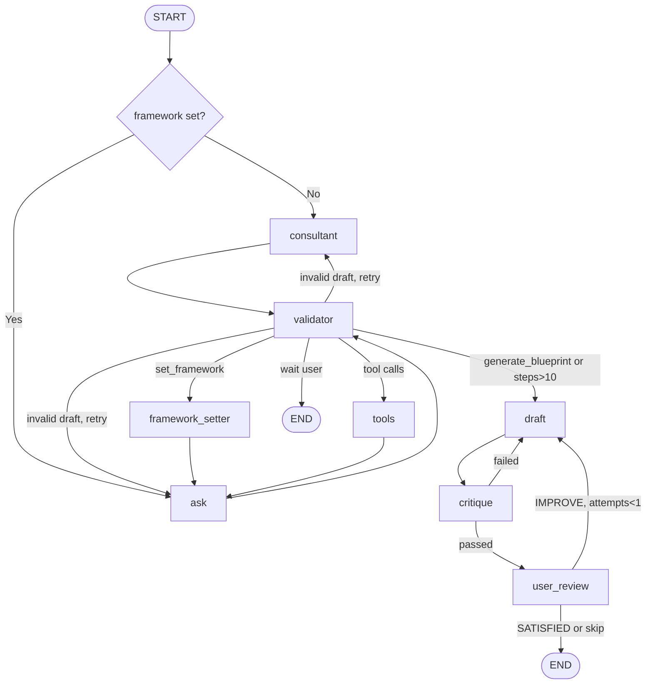

# Vector — AI-Powered Goal Architect

**Vector** is a web app that helps you turn big, fuzzy goals into clear plans. You pick a “framework” (a proven way to think about goals—like First Principles or the 80/20 rule), answer a few questions, and the app turns your answers into a structured blueprint you can save, export to your calendar, or share.

This document explains **what the app does**, **how it’s built**, **how the pieces connect**, and **how you can change or extend it**—including if you’re not a developer.

---

## Table of Contents

- [Vector — AI-Powered Goal Architect](#vector--ai-powered-goal-architect)
  - [Table of Contents](#table-of-contents)
  - [What Vector Does (In Plain Language)](#what-vector-does-in-plain-language)
  - [What We Built \& Why](#what-we-built--why)
  - [How to Run the App](#how-to-run-the-app)
  - [Image Optimization Workflow (Mobile Performance)](#image-optimization-workflow-mobile-performance)
  - [Deploying Vector: Open Router API Key (Beginner Guide)](#deploying-vector-open-router-api-key-beginner-guide)
  - [Replicating Supabase, Auth, Profile, and Feedback in Another Project](#replicating-supabase-auth-profile-and-feedback-in-another-project)
    - [Architecture summary: how this stack is split](#architecture-summary-how-this-stack-is-split)
    - [What to copy from this repo](#what-to-copy-from-this-repo)
    - [Historical implementation order we used in Vector](#historical-implementation-order-we-used-in-vector)
    - [Step-by-step replication guide](#step-by-step-replication-guide)
    - [Detailed auth flow behavior to replicate exactly](#detailed-auth-flow-behavior-to-replicate-exactly)
    - [Detailed profile page behavior to replicate exactly](#detailed-profile-page-behavior-to-replicate-exactly)
    - [Detailed feedback button and admin feedback inbox behavior](#detailed-feedback-button-and-admin-feedback-inbox-behavior)
    - [Supabase dashboard configuration checklist](#supabase-dashboard-configuration-checklist)
    - [Known gotchas from this repo](#known-gotchas-from-this-repo)
  - [Frameworks: List and Explanation](#frameworks-list-and-explanation)
    - [1. First Principles (Elon Musk)](#1-first-principles-elon-musk)
    - [2. Pareto Principle (80/20)](#2-pareto-principle-8020)
    - [3. Tony Robbins RPM (Rapid Planning Method)](#3-tony-robbins-rpm-rapid-planning-method)
    - [4. Eisenhower Matrix](#4-eisenhower-matrix)
    - [5. OKR (Objectives and Key Results)](#5-okr-objectives-and-key-results)
  - [How the AI Works](#how-the-ai-works)
    - [Planner Generator Coach agent (Goal Wizard chat)](#planner-generator-coach-agent-goal-wizard-chat--step-by-step)
  - [Agent Architecture (Technical Deep Dive)](#agent-architecture-technical-deep-dive)
    - [Graph flow diagram](#agent-architecture-graph-flow-diagram)
    - [Execution model: checkpoint vs interrupt](#execution-model-checkpoint-vs-interrupt)
    - [Why we don't use interrupt](#why-we-dont-use-interrupt)
    - [State schema](#agent-state-schema)
    - [Nodes in detail](#agent-nodes-in-detail)
    - [Tools](#agent-tools)
    - [Constants and limits](#agent-constants-and-limits)
    - [Design decisions and tradeoffs](#agent-design-decisions-and-tradeoffs)
  - [How Levels and Credits Work](#how-levels-and-credits-work)
  - [Architecture](#architecture)
    - [Frontend / Backend Split](#frontend--backend-split)
    - [Component Architecture](#component-architecture)
    - [Execution System](#execution-system)
  - [Tech Stack](#tech-stack)
  - [Efficiency, Advantages and Disadvantages](#efficiency-advantages-and-disadvantages)
    - [Efficiency](#efficiency)
    - [Advantages](#advantages)
    - [Disadvantages](#disadvantages)
  - [What Can Be Improved](#what-can-be-improved)
  - [Project Structure: Where Everything Lives](#project-structure-where-everything-lives)
  - [How Everything Is Connected](#how-everything-is-connected)
  - [How to Change or Add Things](#how-to-change-or-add-things)
    - [Add the Desktop Recommendation Banner to another view](#add-the-desktop-recommendation-banner-to-another-framework-view)
    - [Add or edit a framework](#add-or-edit-a-framework)
    - [Add a new language](#add-a-new-language)
    - [Change or add copy (buttons, labels, messages)](#change-or-add-copy-buttons-labels-messages)
    - [Add or edit inspirational quotes](#add-or-edit-inspirational-quotes)
    - [Add a new section or screen](#add-a-new-section-or-screen)
    - [Add or change community templates behavior](#add-or-change-community-templates-behavior)
    - [Change SEO or social preview](#change-seo-or-social-preview)
    - [Change theme (colors, fonts)](#change-theme-colors-fonts)
  - [Technical Summary (For Developers)](#technical-summary-for-developers)
  - [Attribution](#attribution)

---

<a id="what-vector-does-in-plain-language"></a>

## What Vector Does (In Plain Language)

- **Landing page**  
  You see a big headline (“Architect Your Ambition”), a rotating inspirational quote, and cards for ten goal frameworks. Each card has a short description. You can click a card to start building a plan with that framework, or click “Learn more” (info icon) to see details: author, definition, pros, cons, and an example.

- **Goal Wizard**  
  You pick a framework (e.g. Pareto 80/20). The app asks you a few questions in a chat-style flow. When you’re done, it uses **AI** (when configured) to turn your answers into a structured blueprint—for example “Vital Few” vs “Trivial Many” for Pareto, or four quadrants for Eisenhower. That result is then normalized into a shared execution-ready plan with milestones, first-week actions, schedule hints, scorecards, and accountability prompts. You can then **save** the blueprint, **export** it to Google Calendar (or download an .ics file), or **restart** with a new goal.

- **My Blueprints**  
  All blueprints you save appear here (with "Load more" when signed in). You can open one to see the result again, export it, delete it, publish as template, or bulk-export to PDF (Max tier). Data is stored in your browser and, if you’re signed in, in the cloud (Supabase).

- **Tracker + Today**  
  Each saved blueprint can open into a tracker at `/track/:blueprintId`. The tracker is auto-seeded from the plan itself: reminders, sub-goals, tasks, tracking question, and cadence are derived from the normalized plan. The Today page surfaces what is due now, the next best action, and streak risk or recovery guidance.

- **Adaptive Revision Loop**  
  If execution stalls, Vector can revise the plan using real tracker data instead of generating another static answer. The revision flow reads current progress, logs, tasks, completions, and milestones, then produces a tightened version of the same plan and reseeds the execution layer from that revised blueprint.

- **Profile**  
  When you’re signed in, you get a profile page: display name, bio, avatar image URL, level (gamification), and credits (used for AI-generated blueprints). You can edit your info and see how many credits you have left.

- **Community**  
  Users can publish blueprints as **templates**. On the Community page you see those templates (with "Load more" and sort by recent/top), can **vote** on them, **use** one (import it into your blueprints), or **gift points** to the author. Published templates also include a community-proof snapshot and verified history derived from tracker activity.

- **Pricing**  
  Four tiers: **Architect** (free, 1 plan), **Builder** (5 plans, all frameworks + export, one-time), **Max** (20 plans, priority AI, one-time), **Enterprise** (contact). Builder and Max use MercadoPago (LATAM) or Lemon Squeezy (global) when configured; prices are one-time (no subscription yet).

- **Languages & theme**  
  You can switch **language** (e.g. English / Español) and **theme** (light/dark) from the nav. All visible text and framework content can be translated.

- **Share**  
  A “Share” button in the footer uses your device’s share menu when available, or copies the app link to the clipboard.

- **Onboarding**  
  The first time you visit, a short onboarding modal appears: welcome, “choose a mental model,” and a tip (e.g. save blueprints, export to calendar). Completing or skipping it is remembered so it doesn’t show again.

- **SEO & social sharing**  
  The app’s HTML includes a short description and Open Graph / Twitter tags so links look good when shared. Per-framework pages at `/frameworks/:id` have their own title, description, and OG meta (via react-helmet-async) for better discovery and sharing.

---

<a id="what-we-built-and-why"></a>

## What We Built & Why

| What we built                                                                                           | Why                                                                                                                                                                                                                                                                                              |
| ------------------------------------------------------------------------------------------------------- | ------------------------------------------------------------------------------------------------------------------------------------------------------------------------------------------------------------------------------------------------------------------------------------------------ |
| **Ten frameworks** (First Principles, Pareto, RPM, Eisenhower, OKR, DSSS, Mandala, GPS, Misogi, Ikigai) | Each gives a different mental model: break down from basics, focus on 20%, align result/purpose/actions, prioritize by urgency/importance, set objectives and key results, deconstruct skills, map 64 actions, bridge knowledge-execution gaps, undertake radical challenges, find your purpose. |
| **AI-backed blueprints**                                                                                | After you answer, an AI (Open Router) structures your answers into the right format. If the AI isn’t configured or fails, the app falls back to simple rule-based parsing so the wizard still works.                                                                                             |
| **Supabase (auth + database)**                                                                          | So you can sign in with a magic link (no password), and your blueprints and profile can sync across devices.                                                                                                                                                                                     |
| **Profile (level + credits)**                                                                           | To gamify usage (level) and to limit AI usage per user (credits) for cost control.                                                                                                                                                                                                               |
| **Community (templates, vote, gift)**                                                                   | So users can share and reuse plans and reward each other.                                                                                                                                                                                                                                        |
| **Translations (e.g. EN / ES)**                                                                         | So the app and all framework text can be used in multiple languages from one codebase.                                                                                                                                                                                                           |
| **Light/dark theme**                                                                                    | So the app is comfortable in different environments.                                                                                                                                                                                                                                             |
| **Onboarding**                                                                                          | So new users quickly understand value and how to start.                                                                                                                                                                                                                                          |
| **Inspirational quotes**                                                                                | To keep the product feeling motivating.                                                                                                                                                                                                                                                          |
| **Share button**                                                                                        | To make it easy to send the app to friends.                                                                                                                                                                                                                                                      |
| **SEO meta + Open Graph**                                                                               | So the app looks good in search and when shared on social.                                                                                                                                                                                                                                       |

---

<a id="how-to-run-the-app"></a>

## How to Run the App

1. **Install dependencies**  
   In the project folder, run:  
   `npm install`

2. **Configure environment**  
   Create a `.env` file in the **project root** with at least:
   - `VITE_SUPABASE_URL` (or `VITE_supabase_url`) — your Supabase project URL
   - `VITE_ANON_PUBLIC_KEY` — Supabase anon (public) key  
     Optional: `VITE_OPENROUTER_PROXY_URL` (recommended for production) or `VITE_OPENROUTER_API_KEY` for AI; `VITE_GOOGLE_OAUTH_CLIENT_ID` for Google Calendar export; `VITE_MERCADOPAGO_PUBLIC_KEY` for pricing checkout. Backend-only keys (e.g. MercadoPago Access Token, Open Router API key) go in Supabase Secrets or `.env.backend`.

3. **Start the app**  
   Run:  
   `npm run dev`  
   Open the URL shown (usually http://localhost:5173).

4. **Database**  
   In the Supabase dashboard, run the migrations in **`supabase/migrations/`** in order:
   - `20240101000000_baseline_schema.sql` (profiles, blueprints, community_templates, template_votes)
   - `20240131000000_create_analytics_events.sql`
   - `20260131_chat_history.sql` (blueprint_messages table)
   - `20260131_admin_updates.sql` (is_admin, template status/featured, RLS)
   - `20260201_admin_enhancements.sql` (payments table for AdminPayments)
   - `20260201_leaderboard_function.sql` (get_leaderboard RPC)

   Ensure **`decrement_credits`** and **`increment_credits`** RPCs and a **`tier`** column on `profiles` exist; add these in Supabase if not present (see Edge Function webhook and GoalWizard usage).

5. **Backend (payments, secure AI, credits/levels)**  
   The app uses **Supabase Edge Functions** for backend logic:
   - **openrouter-proxy** — Proxies AI requests; API key stays server-side.
   - **mercado-pago-preference** — Creates MercadoPago checkout; returns `init_point` URL.
   - **mercado-pago-webhook** — Handles payment notifications; updates `profiles.credits` and `profiles.tier` via `increment_credits` RPC; calls **send-email** for receipt.
   - **send-email** — Sends transactional emails (receipt after purchase). Called by mercado-pago-webhook. Uses Resend (or similar); requires `RESEND_API_KEY` or equivalent in Supabase Secrets.
   - **handle-new-user** — Triggered by Supabase Database Webhook (INSERT on `auth.users`). Sends welcome email via Resend. Requires `RESEND_API_KEY` and a Database Webhook configured in Supabase Dashboard.

   **Already deployed:** Edge Functions, Supabase Secrets (`OPENROUTER_API_KEY_2` or `OPENROUTER_API_KEY` for the AI proxy, `MERCADOPAGO_ACCESS_TOKEN`), frontend env vars (`VITE_OPENROUTER_PROXY_URL`, `VITE_MERCADOPAGO_PUBLIC_KEY`), MercadoPago webhook configured. Ensure `profiles.tier` and the credit RPCs exist in your database. See **[Deploying Vector: Open Router API Key](#deploying-vector-open-router-api-key-beginner-guide)** for a step-by-step guide.

   **Stripe** (future US implementation): See **[integrations/pending/stripe/](integrations/pending/stripe/)**.

---

<a id="image-optimization-workflow-mobile-performance"></a>

## Image Optimization Workflow (Mobile Performance)

Vector includes high-quality source portraits and assets under `public/images/`. These are useful as masters, but can be too heavy for mobile if used directly.

### Rule

- Re-run `npm run optimize:images` whenever you replace a source image.

### Why this is required

- The optimization script (`scripts/optimize-author-images.mjs`) resizes large originals to mobile-safe dimensions and writes optimized WebP files.
- This reduces transfer size and improves Lighthouse metrics, especially **LCP** and **Speed Index** on mobile.
- If you replace a source image and skip this step, the app can regress by serving oversized files again.

### What the script does

- Reads selected source images in `public/images/authors/`
- Resizes to a bounded resolution (without upscaling)
- Encodes to WebP with high visual quality
- Writes optimized files alongside source assets (original files are preserved)

### Recommended workflow

1. Replace source image(s) in `public/images/authors/`
2. Run `npm run optimize:images`
3. Confirm generated `.webp` files exist and are referenced in code
4. Run `npm run build`
5. Re-test Lighthouse on mobile

### Notes

- Keep originals only as editable masters; serve optimized WebP/AVIF in UI paths.
- If you add a new author file, include it in `scripts/optimize-author-images.mjs` so future updates stay consistent.

---

<a id="deploying-vector-open-router-api-key-beginner-guide"></a>

## Deploying Vector: Open Router API Key (Beginner Guide)

This section explains **exactly** where and how to set the Open Router API key so the AI (Planner Generator Coach and blueprint generation) works after you deploy. If you are new to deployment, read this step by step.

### What “deploy” means here

- **Local:** You run `npm run dev` on your computer. The app talks to Supabase and (if configured) to Open Router. This uses your `.env` and optionally `.env.backend`.
- **Deploy:** You put the app on the internet (e.g. Vercel hosts the frontend, Supabase hosts the database and Edge Functions). The code no longer runs on your machine, so it cannot read your local `.env` or `.env.backend`. You must type the same values into the **hosting dashboards** (Vercel and Supabase) as **Environment Variables** or **Secrets**.

### Why the Open Router key matters

- The app uses **Open Router** to call AI models (e.g. DeepSeek, Gemini). Open Router needs an **API key** to know the requests are from you and to bill you.
- That key is a long string (e.g. `sk-or-v1-...`). You get it from [Open Router](https://openrouter.ai/).
- The app is built to prefer a key named **`VITE_OPENROUTER_API_KEY_2`** (you can also use `VITE_OPENROUTER_API_KEY`). In your **local** setup you might keep this in **`.env.backend`** (which is gitignored so it is never pushed to GitHub).

### Two places that can use the key

There are **two** ways the frontend can talk to Open Router:

1. **Through the proxy (recommended for production)**
   - The **browser** sends the request to **your Supabase Edge Function** (`openrouter-proxy`).
   - The **Edge Function** then calls Open Router with **its own** key (stored in Supabase Secrets).
   - So the key never appears in the browser or in the frontend build. That is more secure.

2. **Direct from the browser**
   - The **browser** calls Open Router directly.
   - The key must then be in the **frontend** environment (e.g. Vercel env vars).
   - Anyone can see it in the built JavaScript if they look. So we only recommend this for quick testing, not for production.

The app is configured to use the **proxy** when you set **`VITE_OPENROUTER_PROXY_URL`**. Your `.env` already has that (pointing to the Supabase function). So in production we rely on the **proxy** and its key.

### Deploy checklist (step-by-step)

Do both parts: **1. Frontend (Vercel)** and **2. Backend (Supabase)**.

---

#### 1. Frontend (Vercel) — what the browser needs

Vercel hosts the React app. At **build time**, Vite bakes environment variables that start with **`VITE_`** into the JavaScript. So you must define them in **Vercel**, not only in `.env` on your computer.

**Steps:**

1. Go to [Vercel](https://vercel.com) and open your **Vector** project.
2. Open **Settings** → **Environment Variables**.
3. Add or confirm these variables (use **Production**, and optionally **Preview** and **Development** if you use them):

   | Name                                                        | Value                                                                         | Notes                                                                                                                                |
   | ----------------------------------------------------------- | ----------------------------------------------------------------------------- | ------------------------------------------------------------------------------------------------------------------------------------ |
   | `VITE_OPENROUTER_PROXY_URL`                                 | `https://YOUR_SUPABASE_PROJECT_REF.supabase.co/functions/v1/openrouter-proxy` | Replace `YOUR_SUPABASE_PROJECT_REF` with your real Supabase project ref (e.g. `rfemwgtomtzbwhfgpcuo`). Same as in your local `.env`. |
   | `VITE_SUPABASE_URL`                                         | `https://YOUR_SUPABASE_PROJECT_REF.supabase.co`                               | Your Supabase project URL.                                                                                                           |
   | `VITE_SUPABASE_PUBLISHABLE_KEY` or `VITE_SUPABASE_ANON_KEY` | Your Supabase anon/public key                                                 | So the app can talk to Supabase (auth, database).                                                                                    |

   **Do you need to put the Open Router key in Vercel?**
   - **If you use the proxy (recommended):** You do **not** need to put `VITE_OPENROUTER_API_KEY_2` or `VITE_OPENROUTER_API_KEY` in Vercel. The browser will call the proxy URL; the proxy (on Supabase) will use the key stored in Supabase Secrets.
   - **If you ever want to call Open Router without the proxy** (e.g. for a quick test): You would add `VITE_OPENROUTER_API_KEY_2` (or `VITE_OPENROUTER_API_KEY`) in Vercel. But then the key is visible in the built app, so we do **not** recommend this for production.

4. Save. Then trigger a **new deployment** (e.g. **Deployments** → **Redeploy** or push a new commit) so the new variables are used in the build.

**Summary for Vercel:** Set `VITE_OPENROUTER_PROXY_URL` (and Supabase URL/keys). Do **not** put the Open Router API key in Vercel when using the proxy.

---

#### 2. Backend (Supabase) — what the proxy needs

The **openrouter-proxy** Edge Function runs on Supabase. It receives requests from the browser and forwards them to Open Router. It needs the Open Router API key **only on the server** (Supabase), not in the browser.

**Steps:**

1. Go to [Supabase](https://supabase.com) and open your **Vector** project.
2. In the left sidebar, open **Edge Functions** (or **Project Settings** → **Edge Functions**).
3. Find where **Secrets** (or **Environment Variables** for Edge Functions) are set. This is often under **Project Settings** → **Edge Functions** → **Secrets**, or in the Edge Functions page.
4. Add or edit a secret:
   - **Name:** `OPENROUTER_API_KEY_2` (recommended) or `OPENROUTER_API_KEY`
   - **Value:** Your Open Router API key (the long `sk-or-v1-...` string). You can copy it from your **`.env.backend`** file (the line `VITE_OPENROUTER_API_KEY_2=sk-or-v1-...` — copy only the part after the `=`).
5. Save. The proxy code is written to use **`OPENROUTER_API_KEY_2`** first; if that is not set, it uses **`OPENROUTER_API_KEY`**. So one of them must be set.

**Important:** Supabase Edge Functions do **not** read your local `.env.backend` file. You must paste the key into the Supabase dashboard. Treat it like a password: only put it in Supabase Secrets, and do not commit it to Git.

**Summary for Supabase:** Set the secret **`OPENROUTER_API_KEY_2`** (or **`OPENROUTER_API_KEY`**) to your Open Router key so the proxy can call Open Router.

---

### How it works end-to-end (with the proxy)

1. User types in the Goal Wizard → the browser sends a request to **`VITE_OPENROUTER_PROXY_URL`** (your Supabase Edge Function).
2. The Edge Function reads **`OPENROUTER_API_KEY_2`** (or **`OPENROUTER_API_KEY`**) from its environment and calls Open Router with that key.
3. Open Router returns the AI response; the proxy returns it to the browser.
4. The browser never sees the key; only Supabase and Open Router use it.

### Using the correct key (e.g. Vector vs Optiland)

When you use the **proxy** (`VITE_OPENROUTER_PROXY_URL`), the browser does **not** send your Open Router key to Open Router. The **Supabase Edge Function** sends the key that is stored in **Supabase Secrets**. So the key that appears in the Open Router dashboard as “Last used” is the one from **Supabase**, not from Vercel or `.env.backend`.

- If Open Router shows the **wrong** key (e.g. “Optiland” instead of “Vector”): the proxy is using whatever is in Supabase Secrets.
- **Fix:** In Supabase → **Edge Functions** → **Secrets**, set **`OPENROUTER_API_KEY_2`** to the key you want to use (e.g. copy the value of **`VITE_OPENROUTER_API_KEY_2`** from your `.env.backend` — the one named “Vector” in Open Router). The proxy prefers `OPENROUTER_API_KEY_2` over `OPENROUTER_API_KEY`. Save and redeploy the Edge Function if needed so the new secret is picked up.
- After that, new completions will use the Vector key and it should show as “Last used” in Open Router for that key.

### Quick verification after deploy

1. Open your deployed app (e.g. `https://your-app.vercel.app`).
2. Go to the Goal Wizard (e.g. pick a framework and start a conversation).
3. Send a message (e.g. “I want to run a marathon in 6 months”).
   - If the coach replies, the proxy and Open Router key are set correctly.
   - If you see an error like “OPENROUTER_API_KEY_2 or OPENROUTER_API_KEY not configured”, the Supabase secret is missing or the Edge Function was not redeployed after adding it.
4. If you use the proxy, you can also check the **Supabase Edge Function logs** for the `openrouter-proxy` function to see if requests are coming in and if any errors are returned.

### Summary table

| Where                                | What to set                                                                | Why                                                                |
| ------------------------------------ | -------------------------------------------------------------------------- | ------------------------------------------------------------------ |
| **Vercel** (frontend)                | `VITE_OPENROUTER_PROXY_URL`, `VITE_SUPABASE_URL`, Supabase anon key        | So the built app knows where to call the proxy and Supabase.       |
| **Vercel** (frontend)                | Do **not** set Open Router key when using proxy                            | The key stays on the server (Supabase).                            |
| **Supabase** (Edge Function secrets) | `OPENROUTER_API_KEY_2` (or `OPENROUTER_API_KEY`) = your `sk-or-v1-...` key | So the openrouter-proxy can call Open Router on behalf of the app. |

If you follow these steps, the deploy checklist for the Open Router key is complete: the frontend uses the proxy URL, and the proxy uses the key stored in Supabase.

---

<a id="replicating-supabase-auth-profile-and-feedback-in-another-project"></a>

## Replicating Supabase, Auth, Profile, and Feedback in Another Project

This section is a **developer handoff guide** for teams who want to copy the same stack used in Vector into a different product. It documents both:

- the **final architecture** we ended up with
- the **actual order we implemented it in this repo**, including the fixes we had to add later

If you are starting a brand-new project, you do **not** need to keep the same historical migration sprawl forever. You can consolidate it into a cleaner initial schema once you understand the behavior you want. But if your goal is to reproduce what Vector already does, this section tells you exactly what was built and why.

<a id="architecture-summary-how-this-stack-is-split"></a>

### Architecture summary: how this stack is split

The auth/profile/feedback stack in Vector is split like this:

| Layer                         | Responsibility                                                                                                             | Where it lives                                                                                                                                          |
| ----------------------------- | -------------------------------------------------------------------------------------------------------------------------- | ------------------------------------------------------------------------------------------------------------------------------------------------------- |
| **Frontend app**              | Creates Supabase browser client, shows auth modal, listens to auth state, loads profile, uploads avatars, submits feedback | `src/lib/supabase.ts`, `src/app/App.tsx`, `src/app/components/AuthModal.tsx`, `src/app/components/Profile.tsx`, `src/app/components/FeedbackButton.tsx` |
| **Supabase Auth**             | Email/password auth, magic links, OAuth, password reset, session cookies/tokens                                            | Supabase Dashboard → Authentication                                                                                                                     |
| **Postgres schema**           | `profiles`, `feedback`, helper functions, RLS policies, delete-account RPC, storage policies                               | `supabase/migrations/*.sql`                                                                                                                             |
| **Supabase Storage**          | Public avatar files in the `avatars` bucket                                                                                | `supabase/migrations/20260203010000_fix_rls_and_storage.sql`                                                                                            |
| **Edge Functions / webhooks** | Optional post-signup welcome email flow                                                                                    | `supabase/functions/handle-new-user/index.ts`                                                                                                           |
| **Admin UI**                  | Lets admins read submitted feedback                                                                                        | `src/app/components/AdminDashboard.tsx`                                                                                                                 |

The important design choice is this:

- the **browser uses only the anon/public key**
- **RLS enforces ownership and admin access**
- the **client still self-heals missing profile rows** by calling `ensure_my_profile()` because signup triggers and OAuth flows can fail in the real world

That last point is not theoretical. We added it because relying on signup triggers alone was not robust enough.

<a id="what-to-copy-from-this-repo"></a>

### What to copy from this repo

If another team wants the same behavior, these are the core pieces to study and either copy directly or re-implement in their own structure:

| File                                                                   | Why it matters                                                                                                |
| ---------------------------------------------------------------------- | ------------------------------------------------------------------------------------------------------------- |
| `src/lib/supabase.ts`                                                  | Browser client creation, env var names, `persistSession`, `autoRefreshToken`, `detectSessionInUrl`            |
| `src/lib/ensureProfile.ts`                                             | Client helper that calls `ensure_my_profile()`                                                                |
| `src/app/App.tsx`                                                      | Session bootstrap, auth subscription, protected-route handling, profile refresh, global feedback button mount |
| `src/app/components/AuthModal.tsx`                                     | Sign in, sign up, magic link, forgot password, Google OAuth, GitHub OAuth, captcha usage                      |
| `src/app/components/Profile.tsx`                                       | Profile fetch/save, avatar upload, email update, password change, linked identities, account deletion         |
| `src/app/components/FeedbackButton.tsx`                                | Floating feedback modal and direct `feedback` table insert                                                    |
| `src/app/components/AdminDashboard.tsx`                                | Admin feedback inbox and feedback pagination                                                                  |
| `supabase/migrations/20240101000000_baseline_schema.sql`               | First version of `profiles` and signup trigger                                                                |
| `supabase/migrations/20260202000000_fix_auth_defaults.sql`             | Fixes signup/profile defaults that caused auth save failures                                                  |
| `supabase/migrations/20260203010000_fix_rls_and_storage.sql`           | `is_admin()` helper and avatar bucket policies                                                                |
| `supabase/migrations/20260204000000_add_profile_metadata.sql`          | Adds profile metadata JSON                                                                                    |
| `supabase/migrations/20260207000000_account_deletion.sql`              | Delete-account RPC and deleted-user tracking                                                                  |
| `supabase/migrations/20260212100000_feedback_table.sql`                | Feedback table and feedback RLS                                                                               |
| `supabase/migrations/20260320120000_ensure_profile_payment_safety.sql` | Final self-healing profile creation strategy                                                                  |
| `supabase/functions/handle-new-user/index.ts`                          | Optional welcome email flow after signup                                                                      |

<a id="historical-implementation-order-we-used-in-vector"></a>

### Historical implementation order we used in Vector

This is the approximate order the auth/profile/feedback stack evolved in this repo. This matters because several later migrations are fixes for issues discovered after the first implementation.

1. **Baseline schema**

- `20240101000000_baseline_schema.sql`
- Created `profiles`, `blueprints`, `community_templates`, and `template_votes`
- Added the first `handle_new_user()` DB trigger to create a `profiles` row when a user is created in `auth.users`
- Added basic RLS so users can insert/update their own profile

2. **Admin support and extra product tables**

- `20260131000000_admin_updates.sql`
- Added `is_admin` and admin-facing policies used later by feedback review and admin views

3. **Credit and tier mechanics**

- `20260201020000_credit_functions.sql`
- Added `decrement_credits()` and `increment_credits()` RPCs
- Later auth/profile flows and payments depend on these existing on the DB side

4. **Auth defaults fix**

- `20260202000000_fix_auth_defaults.sql`
- Added missing default columns like `level`, `points`, `streak_count`, `bio`, `avatar_url`
- Replaced the original trigger body with a safer version after real signup failures
- This migration exists because the original trigger and table shape drifted out of sync and caused “Database error saving new user” failures

5. **RLS recursion fix and avatar storage**

- `20260203010000_fix_rls_and_storage.sql`
- Added `public.is_admin()` as a `SECURITY DEFINER` helper to avoid recursive RLS checks
- Rebuilt admin policies to call `public.is_admin()` instead of directly querying `profiles`
- Created the `avatars` storage bucket and added insert/update/delete policies scoped to the user’s folder name

6. **Extended profile metadata**

- `20260204000000_add_profile_metadata.sql`
- Added a `metadata JSONB` column so the profile page could save richer user context without creating dozens of new top-level columns immediately

7. **Credits expiration and bonus credits**

- `20260205000000_add_extra_credits.sql`
- Added `extra_credits` and `credits_expires_at`
- Updated credit logic so the profile page could display expiring standard credits and non-expiring extra credits separately

8. **Account deletion abuse prevention**

- `20260207000000_account_deletion.sql`
- Added `deleted_users`
- Added `delete_own_account()` RPC
- Updated signup behavior so someone deleting and re-creating an account does not automatically regain free credits forever

9. **Feedback system**

- `20260212100000_feedback_table.sql`
- Added `feedback` table
- Allowed anonymous inserts
- Restricted read access to admins only

10. **Profile creation hardening**

- `20260320120000_ensure_profile_payment_safety.sql`
- Added `ensure_profile_for_user(user_id)` and `ensure_my_profile()`
- Reworked `handle_new_user()` to delegate to that shared logic
- Ensured payments and client flows can create missing profile rows even if the original signup trigger did not

This final step is the most important architectural lesson from the whole implementation: **do not trust signup triggers alone for profile creation**.

<a id="step-by-step-replication-guide"></a>

### Step-by-step replication guide

If another team wants to reproduce this in a new app, this is the clean order to follow.

#### 1. Create the Supabase project

In Supabase, create a new project and collect:

- Project URL
- Anon/public key
- Project ref

If you plan to use OAuth, email confirmations, magic links, or password reset, configure all of that in the same Supabase project. Do **not** create separate auth and database projects.

#### 2. Add the frontend dependencies

At minimum, the new app needs:

- `@supabase/supabase-js`
- `@hcaptcha/react-hcaptcha` if you want the same captcha-protected signup and magic-link UX
- a toast library if you want parity with the success/error handling used in this repo (`sonner` here)
- whatever dialog/input/button primitives your UI kit uses

#### 3. Add the frontend environment variables

Use these env vars as the standard shape in the new project:

- `VITE_SUPABASE_URL`
- `VITE_SUPABASE_ANON_KEY`
- `VITE_HCAPTCHA_SITE_KEY` if you keep captcha

Vector’s client also accepts some fallback names:

- `VITE_supabase_url`
- `VITE_ANON_PUBLIC_KEY`
- `NEXT_PUBLIC_SUPABASE_URL`
- `NEXT_PUBLIC_SUPABASE_ANON_KEY`
- `NEXT_PUBLIC_SUPABASE_PUBLISHABLE_KEY`
- `VITE_SUPABASE_PUBLISHABLE_KEY`

For a new project, pick **one naming convention** and keep it consistent. The simplest option is:

```env
VITE_SUPABASE_URL=https://YOUR_PROJECT.supabase.co
VITE_SUPABASE_ANON_KEY=YOUR_SUPABASE_ANON_KEY
VITE_HCAPTCHA_SITE_KEY=YOUR_HCAPTCHA_SITE_KEY
```

#### 4. Create the browser Supabase client

Replicate the behavior from `src/lib/supabase.ts`:

- create a single shared browser client
- enable `persistSession: true`
- enable `autoRefreshToken: true`
- enable `detectSessionInUrl: true`

`detectSessionInUrl: true` is important because it lets Supabase finish auth flows that return to your app via URL parameters, especially:

- email confirmation links
- magic links
- OAuth callbacks
- password-reset links

If you forget this, some auth flows will appear to “return” to your app but the session will not be restored correctly.

#### 5. Apply the database schema and functions

For parity with this repo, the new project needs these DB features:

- a `profiles` table keyed by `auth.users.id`
- a `feedback` table
- an `avatars` storage bucket
- `handle_new_user()` DB trigger on `auth.users`
- `ensure_profile_for_user(UUID)` function
- `ensure_my_profile()` function callable by authenticated users
- `delete_own_account()` function
- `is_admin()` helper function
- RLS policies for profiles, feedback, and storage

If you want to reproduce this repo exactly, run the relevant migrations in the same order they were introduced.

If you want a **clean new-project version**, build one consolidated initial migration that already includes the final state from these files:

- `20240101000000_baseline_schema.sql`
- `20260202000000_fix_auth_defaults.sql`
- `20260203010000_fix_rls_and_storage.sql`
- `20260204000000_add_profile_metadata.sql`
- `20260205000000_add_extra_credits.sql`
- `20260207000000_account_deletion.sql`
- `20260212100000_feedback_table.sql`
- `20260320120000_ensure_profile_payment_safety.sql`

#### 6. Configure signup-trigger profile creation

The DB-side flow in Vector is:

1. user is created in `auth.users`
2. trigger `public.handle_new_user()` runs
3. trigger calls `public.ensure_profile_for_user(new.id)`
4. that function inserts a `profiles` row if it does not already exist

The reason the final implementation uses `ensure_profile_for_user()` instead of raw insert logic directly in the trigger is simple: once more than one system needs to “guarantee profile exists” behavior, you want one canonical code path.

In Vector, these systems eventually needed the same guarantee:

- signup trigger
- client boot after login
- profile page fetch retries
- payment credit updates

#### 7. Configure the app root to bootstrap auth state

Reproduce the logic from `src/app/App.tsx`:

1. On first load, call `supabase.auth.getSession()`
2. If there is a session:

- set `userId`
- set `userEmail`
- call `ensureMyProfile(supabase)`
- load the current profile (`tier`, `is_admin`, `avatar_url` at minimum)
- load user-owned data that depends on auth

3. Subscribe to `supabase.auth.onAuthStateChange(...)`
4. On `SIGNED_IN`:

- close the auth modal
- set the user state
- call `ensureMyProfile(supabase)` again
- reload profile and user data

5. On `SIGNED_OUT`:

- clear user state
- reset profile-derived state
- fall back to anonymous/local experience if your product supports that

This repo also gates specific routes behind auth. The protected paths list in `App.tsx` currently includes:

- `/wizard`
- `/dashboard`
- `/community`
- `/profile`
- `/analytics`
- `/track`
- `/today`

If an unauthenticated visitor lands on one of those paths, the app:

1. redirects them to `/`
2. opens the auth modal
3. forces the modal into signup mode with the reason `signup_to_try`

That is an intentional product choice. If the new project wants a dedicated login page instead, this is one of the first places to change.

#### 8. Build the auth UI as a multi-mode modal

Vector’s auth UI is not a separate page. It is one modal with four modes:

- `signin`
- `signup`
- `magic_link`
- `forgot_password`

The submit handlers map to Supabase like this:

| Mode            | Supabase call                                                | Notes                                             |
| --------------- | ------------------------------------------------------------ | ------------------------------------------------- |
| Sign in         | `supabase.auth.signInWithPassword({ email, password })`      | Standard email/password login                     |
| Sign up         | `supabase.auth.signUp({ email, password, options })`         | Uses `emailRedirectTo` and optional captcha token |
| Magic link      | `supabase.auth.signInWithOtp({ email, options })`            | Uses `emailRedirectTo` and optional captcha token |
| Forgot password | `supabase.auth.resetPasswordForEmail(email, { redirectTo })` | Sends reset email                                 |
| Google OAuth    | `supabase.auth.signInWithOAuth({ provider: 'google' })`      | Redirects to provider                             |
| GitHub OAuth    | `supabase.auth.signInWithOAuth({ provider: 'github' })`      | Redirects to provider                             |

The exact behaviors implemented in `AuthModal.tsx` are:

- signup defaults are stricter than signin: password must be at least 6 chars and include letters and numbers
- captcha is enforced for `signup` and `magic_link`
- the UI also renders captcha for `forgot_password`, but current submit validation does **not** actually enforce it there
- sign-up success branches in two ways:
  - if Supabase returns `user` but **no session**, the UI shows “check your email to confirm your account”
  - if Supabase returns an immediate session, the modal closes immediately
- magic link and forgot-password both switch the modal into an “email sent” confirmation state
- closing the modal resets mode, fields, confirmation state, and captcha state

#### 9. Add client-side profile self-healing

This is one of the most important parts to copy.

Vector does **not** assume that “signup succeeded” means “profile row definitely exists.” Instead it does all of the following:

- DB trigger tries to create the profile row
- app boot calls `ensureMyProfile(supabase)` after detecting a session
- `SIGNED_IN` event handling calls `ensureMyProfile(supabase)` again
- profile page fetch retries by calling `ensureMyProfile(supabase)` if the first profile select returns `PGRST116` or no row

This is the code path:

- frontend helper: `src/lib/ensureProfile.ts`
- RPC function: `public.ensure_my_profile()`
- DB core function: `public.ensure_profile_for_user(UUID)`

If the new team skips this and relies only on auth triggers, they will eventually see orphaned users with no profile rows.

#### 10. Build the profile page against the `profiles` table

The profile page in `src/app/components/Profile.tsx` does more than a simple name/avatar form. It currently handles:

- loading profile data
- editing profile fields
- editing auth email
- changing password
- linking Google/GitHub identities
- unlinking identities
- uploading an avatar to Supabase Storage
- exporting user data
- showing current tier, credits, streak, points, and plan status
- deleting the user’s own account via RPC

The profile page reads these profile fields directly from `profiles`:

- `display_name`
- `bio`
- `avatar_url`
- `level`
- `credits`
- `extra_credits`
- `credits_expires_at`
- `points`
- `streak_count`
- `branding_logo_url`
- `branding_color`
- `tier`
- `metadata`

The page saves these fields back through `.upsert(...)` on `profiles`:

- `display_name`
- `bio`
- `avatar_url`
- `branding_logo_url`
- `branding_color`
- `metadata`
- `updated_at`

The page updates auth-managed fields separately:

- email changes use `supabase.auth.updateUser({ email })`
- password changes use `supabase.auth.updateUser({ password })`

That separation matters. Do not try to store the canonical auth email only in `profiles`; email ownership and confirmation belong to Supabase Auth.

#### 11. Configure avatar uploads with a bucket per user folder

Vector’s avatar flow works like this:

1. user chooses a file in the profile page
2. frontend uploads it to `storage.from('avatars')`
3. object key is `userId/timestamp.extension`
4. frontend reads the public URL with `getPublicUrl(...)`
5. frontend updates `profiles.avatar_url`

The storage policies from `20260203010000_fix_rls_and_storage.sql` are important because they enforce that the first path segment equals the authenticated user id:

- read: any avatar in the public bucket can be viewed
- insert/update/delete: only the owner can manage files in their own folder

If the new team wants private avatars instead of public URLs, they need a different storage design. Vector uses public avatars for simplicity.

#### 12. Add delete-account support

Vector’s delete-account path is implemented with a DB RPC, not a client-side multi-step cascade.

The function `delete_own_account()`:

1. looks up the authenticated user’s email in `auth.users`
2. writes that email into `public.deleted_users`
3. deletes the auth user row from `auth.users`

The `deleted_users` table exists so a user cannot keep deleting and re-creating accounts to repeatedly farm fresh free credits.

If the new project needs GDPR/compliance workflows, soft-delete, or admin-restorable accounts, build that explicitly. Vector’s implementation is simple and product-driven.

<a id="detailed-auth-flow-behavior-to-replicate-exactly"></a>

### Detailed auth flow behavior to replicate exactly

If the new team wants the **same UX**, this is the exact flow users experience in Vector.

#### Login

- User clicks Sign in
- `AuthModal` opens in `signin` mode
- User can either:
  - enter email/password
  - continue with Google
  - continue with GitHub
  - switch to magic-link sign-in
  - switch to forgot-password
- On success:
  - toast is shown
  - modal closes
  - root app receives `SIGNED_IN`
  - user/profile state is refreshed

#### Signup

- User opens `AuthModal` in `signup` mode
- If they were blocked by a protected route, the app passes `reason="signup_to_try"`, which forces signup mode automatically
- User enters email + password
- Password must be at least 6 chars and contain letters and numbers
- User completes hCaptcha
- App calls `signUp(...)` with:
  - `emailRedirectTo = window.location.origin`
  - `captchaToken`
- If email confirmation is enabled and no session is returned immediately:
  - modal switches to an email confirmation state
  - app instructs user to check inbox/spam
- Once user confirms and returns, `detectSessionInUrl` lets Supabase restore the session

#### Magic link

- User switches to `magic_link` mode
- User enters email
- User completes hCaptcha
- App calls `signInWithOtp(...)`
- Modal shows email-sent confirmation state
- User clicks email link and returns to app

#### Forgot password

- User switches to `forgot_password`
- App calls `resetPasswordForEmail(email, { redirectTo: window.location.origin + '/reset-password' })`
- Modal shows email-sent confirmation state

Important: in the current repo, the reset email points to `/reset-password`, but there is **no matching reset-password route in the frontend codebase**. If another team copies this flow, they should either:

1. implement a real `/reset-password` page that consumes the recovery session and lets the user set a new password, or
2. change the redirect target to a route that already exists

If they do neither, forgot-password emails will send users to a dead end.

#### OAuth

- Google and GitHub are both supported in the auth modal
- Both use `redirectTo: window.location.origin`
- On return, the app relies on `detectSessionInUrl: true` and `onAuthStateChange(...)`
- After `SIGNED_IN`, the app calls `ensureMyProfile(...)` before loading profile-derived state

<a id="detailed-profile-page-behavior-to-replicate-exactly"></a>

### Detailed profile page behavior to replicate exactly

The current profile page is not just a static account form. It mixes identity, personalization, credits, and plan management.

#### Data loading

When the profile page mounts:

1. it calls `supabase.auth.getUser()`
2. it reads linked identities from `user.identities`
3. it queries `profiles` by `user_id`
4. if the row is missing, it calls `ensureMyProfile(supabase)` and retries the query
5. it hydrates the page state from the result

#### Editable fields

The profile page exposes all of these inputs today:

- email
- display name
- bio
- avatar upload
- age
- gender
- country
- zodiac sign
- zodiac importance
- hobbies
- skills
- interests
- values
- vision
- other observations
- preferred plan style
- what helps user stay on track
- question flow preference
- preferred tone
- treatment level
- branding logo URL
- branding color

Most of those extended fields are stored inside `profiles.metadata`.

#### Save behavior

The save button does the following in one handler:

1. `.upsert(...)` the editable profile fields into `profiles`
2. if email changed, call `supabase.auth.updateUser({ email })`
3. show a success toast
4. call `onProfileUpdate()` so parent UI can refresh avatar/tier if needed

#### Avatar behavior

- upload starts immediately after file selection
- file goes to the `avatars` bucket
- public URL is generated immediately
- `profiles.avatar_url` is updated immediately after upload
- parent UI can re-fetch avatar after save

#### Security behavior

- password change happens on the profile page via `supabase.auth.updateUser({ password })`
- linked providers can be added with `linkIdentity({ provider })`
- providers can be removed with `unlinkIdentity(identityId)`
- the UI blocks unlinking if only one sign-in method remains

#### Delete account behavior

- user must type `DELETE`
- page calls `supabase.rpc('delete_own_account')`
- on success, frontend signs the user out and redirects to `/`

#### Billing and credits behavior on the profile page

If the new project wants full parity, the profile page also displays:

- current tier
- available credits
- regular credits vs extra credits
- expiry date for regular credits
- points, level, and streak
- upgrade CTA

Those parts are specific to Vector’s monetization/gamification model, so copy them only if the new project actually needs the same product behavior.

<a id="detailed-feedback-button-and-admin-feedback-inbox-behavior"></a>

### Detailed feedback button and admin feedback inbox behavior

The feedback flow in Vector is deliberately simple: the browser inserts directly into a `feedback` table using the public/anon Supabase client, and RLS decides what is allowed.

#### What the user sees

- A floating `Feedback` button is mounted globally in `App.tsx`
- It receives:
  - current route as `pageContext`
  - `userEmail`
  - `userId`
- It is not mounted on wizard routes in the current app layout

The modal asks for:

- optional 1-5 rating
- required free-text message
- optional email, but only if the visitor is not signed in

#### How submission works

On submit, `FeedbackButton.tsx` does this insert:

```ts
await supabase.from("feedback").insert({
  user_id: userId || null,
  message: trimmed,
  rating: rating ?? null,
  page_context: pageContext || null,
  email: userEmail ? null : email.trim() || null,
});
```

That means:

- signed-in users are associated by `user_id`
- anonymous users can still submit feedback
- signed-in users do **not** duplicate their email into the `email` column
- anonymous users can optionally leave a contact email

#### Database behavior

The `feedback` table currently contains:

- `id`
- `user_id`
- `message`
- `rating`
- `page_context`
- `email`
- `created_at`

RLS policy behavior is:

- anyone can insert feedback
- only admins can select feedback

Admin access is enforced by the `public.is_admin()` helper, not by directly querying `profiles` inside the policy.

#### Admin feedback inbox

Admins review feedback through `AdminDashboard.tsx`:

- feedback tab queries `feedback`
- results are ordered by `created_at desc`
- page size is 15
- admin can see rating, originating page, message, contact, and created date
- if `email` is missing but `user_id` exists, the UI lets the admin jump to that user instead

If the new project does not need anonymous feedback, remove the open insert policy and require auth before insert. Vector chose anonymous feedback deliberately to reduce friction.

<a id="supabase-dashboard-configuration-checklist"></a>

### Supabase dashboard configuration checklist

The new team should configure all of this in the Supabase dashboard, not just the SQL schema.

#### Authentication

- Enable Email auth
- Decide whether email confirmation is required
- Enable Google OAuth if you want parity with Vector
- Enable GitHub OAuth if you want parity with Vector
- Add the correct site URL and redirect URLs for local and production environments

At minimum, redirect URLs should cover:

- local frontend origin, for example `http://localhost:5173`
- production frontend origin, for example `https://your-app.com`
- if implementing password reset properly, the reset route too

#### Captcha

If you keep the same auth UX:

- configure hCaptcha in Supabase Auth settings if your auth configuration uses captcha verification server-side
- add `VITE_HCAPTCHA_SITE_KEY` to the frontend

#### Database

- run the required migrations
- verify `profiles` exists and has the fields the profile page reads
- verify `feedback` exists
- verify `ensure_my_profile()` is callable by `authenticated`
- verify `delete_own_account()` is callable by `authenticated`
- verify `is_admin()` exists before adding admin-only feedback policies

#### Storage

- create the `avatars` bucket or run the migration that creates it
- verify it is public if you want public avatar URLs
- verify folder-based policies use the user id path segment

#### Optional welcome email

If the new project also wants the welcome-email behavior used here:

- deploy `supabase/functions/handle-new-user`
- set `RESEND_API_KEY` in Supabase secrets
- configure a Supabase Database Webhook on `auth.users` insert

Important: this Edge Function is **not** the same thing as the DB trigger function `public.handle_new_user()`. In Vector, both exist:

- SQL `handle_new_user()` creates the profile row
- Edge Function `handle-new-user` sends the welcome email

<a id="known-gotchas-from-this-repo"></a>

### Known gotchas from this repo

These are the mistakes, edge cases, or non-obvious behaviors another team should know before copying this implementation.

1. **Do not rely only on auth triggers to create profiles.**

- The final solution in this repo uses a trigger **and** client-side self-healing via `ensure_my_profile()`.

2. **Make sure the signup trigger inserts only columns that actually exist.**

- One historical auth failure came from trigger logic referencing a column shape that had drifted.

3. **Implement a real password reset page if you keep `redirectTo: /reset-password`.**

- The auth modal already sends users there, but this repo currently does not expose that route.

4. **Do not query `profiles` directly inside admin RLS policies if that creates recursion.**

- Use a `SECURITY DEFINER` helper like `public.is_admin()`.

5. **Create the `avatars` bucket and its policies before shipping avatar upload UI.**

- Otherwise uploads or updates will fail even if the profile page itself is correct.

6. **Separate auth-owned data from profile-owned data.**

- Email/password belong to Supabase Auth.
- Display name, bio, avatar, preferences, and other app profile fields belong in `profiles`.

7. **If you allow anonymous feedback, accept that your anon key can write to `feedback`.**

- That is intentional in Vector. If the new product wants stricter anti-spam controls, add auth requirements, rate limiting, captcha, or a server-side endpoint.

8. **The profile page in this repo is tightly coupled to Vector’s credits/tier product model.**

- A new app may want only the identity/personalization parts and not the billing widgets.

9. **OAuth, magic link, and email confirmation all depend on correct redirect URLs.**

- If the URLs do not match the frontend origin exactly, those flows will fail or return to the wrong place.

10. **If you are starting from scratch, consolidate the final DB state into fewer migrations.**

- The README lists the historical order because that is how Vector evolved, not because that is the cleanest way to start a brand-new codebase.

---

<a id="frameworks-list-and-explanation"></a>

## Frameworks: List and Explanation

Vector uses ten goal-setting frameworks. Each gives a different mental model for breaking down ambitions into actionable plans.

| Framework             | Author                            | One-line idea                                                                 |
| --------------------- | --------------------------------- | ----------------------------------------------------------------------------- |
| **First Principles**  | Elon Musk / Aristotle             | Break problems into basic truths, then rebuild from zero.                     |
| **Pareto (80/20)**    | Vilfredo Pareto                   | Focus on the 20% of efforts that yield 80% of results.                        |
| **RPM**               | Tony Robbins                      | Result (what), Purpose (why), Massive Action Plan (how).                      |
| **Eisenhower Matrix** | Dwight D. Eisenhower              | Sort tasks by urgency and importance into four quadrants.                     |
| **OKR**               | John Doerr / Andy Grove           | Set one Objective and a few measurable Key Results.                           |
| **DSSS**              | Tim Ferriss                       | Deconstruct, Select the 20%, Sequence, Stakes—meta-learning for any skill.    |
| **Mandala Chart**     | Shohei Ohtani (popularized)       | 9×9 grid: central goal + 8 categories, each with 8 actionable steps.          |
| **GPS**               | Productivity Framework            | Goal, Plan, System—bridge the knowledge and execution gaps.                   |
| **Misogi**            | Jesse Itzler / Dr. Marcus Elliott | One defining challenge per year with ~50% fail rate; spiritual reset.         |
| **Ikigai**            | Mieko Kamiya                      | Find your reason for being at the overlap of love, skill, need, and vocation. |

### 1. First Principles (Elon Musk)

- **Definition:** Break a problem into its fundamental truths (no analogy or convention), then reassemble a solution from the ground up.
- **Pros:** Encourages innovation, removes assumptions, leads to unique solutions.
- **Cons:** Time-consuming, mentally taxing, requires deep understanding.
- **Example:** SpaceX reduced rocket cost by calculating raw material cost instead of buying pre-assembled parts.
- **When to use:** When you want to question the “obvious” way of doing things and design a new approach.

### 2. Pareto Principle (80/20)

- **Definition:** For many outcomes, roughly 80% of consequences come from 20% of causes.
- **Pros:** Increases efficiency, focuses resources, simple to apply.
- **Cons:** Oversimplifies complex systems; the 80/20 ratio is an estimate; can miss small but crucial details.
- **Example:** A software team fixes the top 20% of reported bugs to resolve 80% of user crashes.
- **When to use:** When you need to prioritize ruthlessly and cut “trivial many” in favor of the “vital few.”

### 3. Tony Robbins RPM (Rapid Planning Method)

- **Definition:** Define the **Result** (what you want), the **Purpose** (why it matters), and a **Massive Action Plan** (how you’ll get there).
- **Pros:** Highly motivating, aligns actions with values, reduces busy work.
- **Cons:** Can feel overwhelming at first; requires emotional buy-in; less rigid than other frameworks.
- **Example:** Instead of “Go to gym,” the goal is “Vibrant health” (Result) because “I want energy for my kids” (Purpose) by “Running 3×/week” (Map).
- **When to use:** When you want goals tied to meaning and a clear “why,” not just a to-do list.

### 4. Eisenhower Matrix

- **Definition:** Split tasks into four quadrants: **Urgent & Important** (do first), **Important, not urgent** (schedule), **Urgent, not important** (delegate), **Neither** (eliminate).
- **Pros:** Clear prioritization, reduces procrastination, gives a delegation framework.
- **Cons:** Categorization is subjective; doesn’t account for effort; can become a procrastination tool.
- **Example:** “Server down” → Q1; “Strategic planning” → Q2; “Most emails” → Q3; time-wasters → Q4.
- **When to use:** When you’re overwhelmed by tasks and need to separate “do now” from “schedule” and “drop.”

### 5. OKR (Objectives and Key Results)

- **Definition:** Set one ambitious **Objective** (qualitative) and 3–5 **Key Results** (measurable outcomes) over a set period (e.g. 90 days).
- **Pros:** Aligns teams, measurable progress, encourages ambition.
- **Cons:** Can be too rigid; setting good metrics is hard; missed targets can demotivate.
- **Example:** Objective: “Increase brand awareness.” Key Result: “Reach 10,000 active monthly users.”
- **When to use:** When you want measurable, time-bound goals (personal or team) with clear success criteria.

### 6. DSSS (Tim Ferriss)

- **Definition:** Deconstruct the skill, Select the 20% that delivers 80%, Sequence the order, and set Stakes (accountability).
- **Pros:** Rapid learning, focuses on high-impact areas, accountability built-in.
- **Cons:** Requires discipline; stakes can be stressful; needs good analysis.
- **Example:** Learning Spanish: Deconstruct grammar/vocab, Select top 1200 words, Sequence sentence structures, Stake $100 on passing a test.
- **When to use:** When you want to master a skill quickly and systematically.

### 7. Mandala Chart

- **Definition:** A visual chart with a central goal surrounded by 8 categories, each with 8 actionable steps (64 items total).
- **Pros:** Comprehensive, visualizes connections, balances huge goals.
- **Cons:** Can become complex; requires 64 specific items; hard to track all at once.
- **Example:** Central goal: "Best Player." Categories: Fitness, Mental, Control, Speed, Luck, Human Quality, etc.
- **When to use:** When you have a large, multifaceted goal you want to map visually.

### 8. GPS (Goal, Plan, System)

- **Definition:** Success isn't just willpower; it's about solving the Knowledge Gap and the Execution Gap with clear Goal, Plan, and System.
- **Pros:** Action-oriented, bridges execution gap, scalable.
- **Cons:** Requires initial setup, needs tracking discipline.
- **Example:** Goal: Run 10k. Plan: Training app. System: Strava + accountability.
- **When to use:** When you struggle to turn knowledge into action.

### 9. Misogi Challenge

- **Definition:** One voluntary hardship per year with ~50% chance of success; rules: really hard, you can't die.
- **Pros:** Radical confidence boost, re-baselines difficulty, spiritual purification.
- **Cons:** High chance of failure, physical/mental strain, not a daily productivity tool.
- **Example:** Paddleboarding across a 30-mile channel without ever having paddled more than 5 miles.
- **When to use:** When you want one defining challenge to reset your baseline and build resilience.

### 10. Ikigai

- **Definition:** Japanese "reason for being." Your ikigai is where four circles overlap: what you love, what you're good at, what the world needs, what you can be paid for.
- **Pros:** Clarity on life direction, bridges passion and livelihood, reduces existential drift.
- **Cons:** Requires deep self-reflection; the intersection can feel narrow; takes time to articulate.
- **Example:** Love: teaching. Good at: explaining. World needs: STEM educators. Paid for: curriculum design. Purpose: courses that make science accessible.
- **When to use:** When you want clarity on purpose and direction.

In the app, each framework has a **detail modal** (Learn more) with author, definition, pros, cons, and example. The **Goal Wizard** asks framework-specific questions and produces a structured blueprint (e.g. Vital/Trivial for Pareto, four quadrants for Eisenhower).

---

<a id="how-the-ai-works"></a>

## How the AI Works

Vector uses **Open Router** to turn your questionnaire answers into a structured blueprint when an API key is configured.

### Planner Generator Coach agent (Goal Wizard chat) — step-by-step

When you chat with the “Planner Generator Coach” in the Goal Wizard, a **LangGraph agent** (`src/agent/goalAgent.ts`) runs in the browser. Here is how it works.

**How the agent thinks, plans, and waits**

- **Thinks:** Each node (consultant, ask, draft, critique, user_review) sends the conversation history, user profile, and form context to the LLM. The model reasons over this context to decide what to ask next, whether to suggest a framework, whether it has enough info to generate a blueprint, and how to improve the plan.
- **Plans:** Before generating the final blueprint, the agent (1) gathers info via consultant/ask (for fitness/health goals it must ask about body/constraints, habits, and past experience before considering “enough info”), (2) updates a rough-draft JSON block as it learns, (3) requires **explicit user confirmation** before generating—it must ask “Does this analysis make sense? Anything to add before I generate?” or “Ready for me to generate your plan?” and never show or declare the plan ready until the user confirms, (4) runs the draft through a **critique** (framework-specific rubric), and (5) runs a **user-perspective review** (acts as the user to spot gaps). If critique or review finds issues, the agent loops back to refine the blueprint up to once each.
- **Waits:** The agent does **not** pause mid-run. It runs from START to END in one go. When it needs the user's reply, it reaches END and checkpoints. The next message starts a new run with the restored state. See [Why we don't use interrupt](#why-we-dont-use-interrupt) below.

**1. Single run, one message**

Each time you send a message, the app calls `graph.stream(inputs, config)` once. The graph runs until it reaches a “wait for user” state (END) or finishes generating a blueprint. So one user message can trigger several internal steps (nodes) before the next reply appears.

**2. Nodes (what runs)**

| Node                 | What it does                                                                                                                                                                                                                                            | Calls Open Router? |
| -------------------- | ------------------------------------------------------------------------------------------------------------------------------------------------------------------------------------------------------------------------------------------------------- | ------------------ |
| **consultant**       | First reply: suggests frameworks, asks about goal/timeline. Runs when there is no framework set yet.                                                                                                                                                    | Yes (with tools)   |
| **ask**              | Follow-up replies: refines the plan, asks 1–2 questions, can update a “draft” JSON. Runs when a framework is already chosen.                                                                                                                            | Yes (with tools)   |
| **framework_setter** | Applies the “switch framework” tool: updates state and adds a short confirmation message.                                                                                                                                                               | No                 |
| **tools**            | Runs the LLM’s tool calls (e.g. set_framework, generate_blueprint).                                                                                                                                                                                     | No                 |
| **validator**        | Depth check: if the LLM called generate_blueprint, requires at least 3 user messages (else injects a “ask one more question” correction). Also checks the draft JSON block; if invalid, injects a correction and sends the flow back to consultant/ask. | No                 |
| **draft**            | Generates the final blueprint JSON from the conversation.                                                                                                                                                                                               | Yes (no tools)     |
| **critique**         | Reviews the blueprint; if it fails, sends the flow back to draft.                                                                                                                                                                                       | Yes (no tools)     |
| **user_review**      | Role-plays as user; reviews blueprint; returns SATISFIED or IMPROVE.                                                                                                                                                                                    | Yes (no tools)     |

**3. Tools (what the LLM can “call”)**

- **set_framework** — User asks to change method (e.g. from First Principles to OKR). The graph then goes to **framework_setter** and then back to **ask**.
- **generate_blueprint** — User says they’re ready (e.g. “yes”, “listo”). The graph goes to **draft** to produce the final blueprint.

**4. Routes (possible paths)**

- **START** → If no framework: **consultant**. If framework already set: **ask**.
- After **consultant** or **ask** → **validator** (always).
- **validator** →
  - If draft JSON was invalid and we injected a correction → **consultant** or **ask** (to re-answer).
  - Else: **END** (wait for user), or **framework_setter** (LLM called set_framework), or **tools** (LLM called a tool), or **draft** (LLM called generate_blueprint).
- **framework_setter** → **ask**.
- **tools** → **ask**.
- **draft** → **critique** → **draft** again (if critique failed), or **user_review** (if passed) → **draft** (if improvements suggested) or **END**.

So the “possible routes” are: consultant ↔ validator, ask ↔ validator, sometimes framework_setter → ask, tools → ask, and when the user is ready: validator → draft → critique → (draft retry or user_review) → (draft refinement or END). See [Agent Architecture (Technical Deep Dive)](#agent-architecture-technical-deep-dive) for full details.

**5. Model fallback and timeouts**

- Every Open Router call goes through **invokeWithFallback**: it tries the **primary model** (DeepSeek V3.2) first, then, in order: Gemini 3 Flash Preview, Kimi K2.5, Gemini 2.0 Flash, OpenAI GPT-4o.
- **Per-model timeout:** Each model attempt is limited to **35 seconds**. If that model doesn’t respond within 35s, the agent **does not** wait longer; it **tries the next model** in the list. So if DeepSeek is slow or stuck, the user gets a reply from a fallback model instead of a generic “timeout” error.
- **Stream timeout (GoalWizard):** The UI waits up to **35 seconds** for the _first_ reply from the agent (first event from the stream). If nothing arrives in 35s, the user sees “Timeout: Agent is taking too long to respond.” With the 35s per-model timeout inside the agent, the first reply should usually come within 35s (from either the primary or a fallback model), unless the network or Open Router is severely slow.

**6. Why you might still see “took too long”**

- Previously the **stream** timeout was 15s. So even if DeepSeek was going to answer in 20s, the UI gave up at 15s and showed a connection error. That timeout is now **35s** so it matches the per-model limit.
- If the **first** model (e.g. DeepSeek) really takes more than 35s (e.g. cold start, overloaded provider), the agent now **automatically tries the next model** instead of failing the whole run. So the user can wait up to 35s for the first reply, and the fallback model is used when the first one is too slow.

---

1. **When it runs:** After you answer the last question in the Goal Wizard, the app sends your answers to Open Router (model: `openai/gpt-4o-mini` by default).
2. **What is sent:** A **system prompt** (framework-specific) that describes the exact JSON shape (e.g. `truths`, `newApproach` for First Principles; `vital`, `trivial` for Pareto). The **user message** is: framework name + numbered list of your answers.
3. **What comes back:** The model is instructed to return **only** valid JSON. The app strips markdown code fences if present, parses the JSON, and validates it against the expected schema for that framework. If validation fails, the result is discarded.
4. **Fallback:** If `VITE_OPENROUTER_API_KEY` is missing, the request fails, or the response is invalid, the app uses a **rule-based** `generateResult` in `GoalWizard.tsx`: simple string splitting (commas, newlines) and mapping into the same blueprint shape. The wizard always produces a result; AI only improves structure and nuance.
5. **Security note:** The API key is read from the frontend env (`VITE_OPENROUTER_API_KEY`), so it is exposed in the client. For production, use a backend proxy that holds the key and calls Open Router server-side.

Relevant code: `src/lib/openrouter.ts` (API client, system prompts, JSON parsing/validation) and `src/app/components/GoalWizard.tsx` (calls `generateBlueprintResult`, then falls back to `currentConfig.generateResult(answers)`).

---

<a id="agent-architecture-technical-deep-dive"></a>

## Agent Architecture (Technical Deep Dive)

This section documents the **Planner Generator Coach** agent in full technical detail so a developer can understand every design choice, flow, and component. Use it for architecture review, onboarding, or evaluating whether we are using the best design and tools.

### Overview

The agent is a **LangGraph JS** state machine that runs **in the browser**. It guides users through goal refinement, asks questions, and produces a structured JSON blueprint. Key design decisions:

| Decision              | Choice                                    | Rationale                                                                                            |
| --------------------- | ----------------------------------------- | ---------------------------------------------------------------------------------------------------- |
| **Runtime**           | Browser (client-side)                     | No backend service to run the agent; lower latency; user data stays on device until sent to AI proxy |
| **Framework**         | LangGraph JS (`@langchain/langgraph`)     | Stateful graphs, conditional routing, tool calling, checkpointing                                    |
| **LLM**               | Open Router (DeepSeek primary, fallbacks) | Cost, model flexibility, single API                                                                  |
| **State persistence** | Checkpointer (Supabase or in-memory)      | Conversation survives across turns; no “run from zero” each message                                  |
| **Interrupt**         | None                                      | We use checkpoint-at-END, not `interruptBefore`; each turn runs to completion                        |

### Agent Architecture: Graph Flow Diagram

```
┌─────────────────────────────────────────────────────────────────────────────────────────────────────────────┐
│                                           LANGGRAPH AGENT FLOW                                                │
└─────────────────────────────────────────────────────────────────────────────────────────────────────────────┘

                                         ┌─────────┐
                                         │  START  │
                                         └────┬────┘
                                              │
                                    ┌─────────▼─────────┐
                                    │    routeStart     │
                                    │ framework set?    │
                                    └────┬────────┬─────┘
                                         │        │
                              No ────────┘        └──────── Yes
                               │                            │
                               ▼                            ▼
                    ┌──────────────────┐         ┌──────────────────┐
                    │   consultant     │         │      ask         │
                    │ (suggest fw,     │         │ (framework Q&A,   │
                    │  ask about goal) │         │  draft JSON,     │
                    └────────┬─────────┘         │  tools)          │
                             │                   └────────┬─────────┘
                             │                            │
                             └────────────┬───────────────┘
                                          │
                                          ▼
                               ┌──────────────────────┐
                               │     validator        │
                               │ (check rough-draft   │
                               │  JSON; inject fix    │
                               │  or pass)            │
                               └──────────┬───────────┘
                                          │
                        ┌─────────────────┼─────────────────┬─────────────────┐
                        │                 │                 │                 │
                        ▼                 ▼                 ▼                 ▼
               ┌──────────────┐  ┌──────────────┐  ┌──────────────┐  ┌──────────────┐
               │    ask       │  │  consultant  │  │ framework_   │  │    tools     │
               │ (fix draft)  │  │ (fix draft)  │  │   setter     │  │ (run LLM     │
               └──────┬───────┘  └──────┬───────┘  │ or set_fw)   │  │  tool calls) │
                      │                 │          └──────┬───────┘  └──────┬───────┘
                      │                 │                 │                 │
                      └─────────────────┴─────────────────┴─────────────────┘
                                          │
                        (generate_blueprint called OR steps > 10)
                                          │
                                          ▼
                               ┌──────────────────────┐
                               │       draft          │
                               │ (generate final      │
                               │  blueprint JSON)     │
                               └──────────┬───────────┘
                                          │
                                          ▼
                               ┌──────────────────────┐
                               │     critique         │
                               │ (rubric check;       │
                               │  pass or retry)      │
                               └──────────┬───────────┘
                                          │
                        ┌─────────────────┴─────────────────┐
                        │                                   │
            critiqueAttempts === 1                  critiqueAttempts === 0
            (failed)                                (passed)
                        │                                   │
                        ▼                                   ▼
               ┌──────────────┐                  ┌──────────────────────┐
               │    draft     │                  │    user_review       │
               │ (retry once) │                  │ (act as user, review │
               └──────────────┘                  │  blueprint; SATISFIED│
                                                 │  or IMPROVE)         │
                                                 └──────────┬───────────┘
                                                            │
                                          ┌─────────────────┴─────────────────┐
                                          │                                   │
                              userReviewRequestsRefinement           SATISFIED or
                              (improvements suggested)                skip (max refined)
                                          │                                   │
                                          ▼                                   ▼
                                 ┌──────────────┐                      ┌──────────────┐
                                 │    draft     │                      │     END      │
                                 │ (refine from │                      │ (deliver     │
                                 │  feedback)   │                      │  blueprint)  │
                                 └──────┬───────┘                      └──────────────┘
                                        │
                                        └──────────────────▶ critique → user_review → END
                                                             (max 1 refinement)
```

Mermaid diagram (for tools that support it):



### Execution model: checkpoint vs interrupt

- **No LangGraph interrupt**  
  We do **not** use `interruptBefore` or `interruptAfter`. The graph runs until it hits END. There is no “pause mid-node” to wait for user input.

- **Checkpoint-based persistence**  
  Each run goes: **START → … → END**. When it reaches END, LangGraph checkpoints the state. The next user message triggers a **new run** that:
  1. Loads the checkpointed state for the same `thread_id`
  2. Merges the new input (e.g. `messages: [new HumanMessage(userText)]`) via reducers
  3. Executes from START again with the updated state

- **Effect**  
  Conversation history, `blueprint`, `framework`, etc. are preserved across turns. The client sends only the **new** user message; full history comes from the checkpoint.

- **Checkpointer**
  - **Supabase** (`SupabaseCheckpointer`): when configured, persists to `checkpoints` and `checkpoint_writes` tables
  - **MemorySaver**: fallback when Supabase is not configured; in-memory only, lost on refresh

- **Thread ID**  
  The frontend uses a stable `thread_id` (e.g. from localStorage, valid for 24h). Same thread ⇒ same checkpoint chain.

### Why we don't use interrupt

We do **not** use LangGraph's `interruptBefore` or `interruptAfter`. The graph always runs to END; there is no "pause mid-node" to wait for user input.

**Reasons:**

1. **Simplicity:** Our flow is linear: gather info → validate → optionally draft/critique/review → END. When we need user input, we naturally hit END. A new run with the next message restores state. Adding interrupt would complicate the graph without clear benefit.
2. **Turn-based UX:** The Goal Wizard is turn-based: user sends a message, agent replies. Each "wait" is at END. Checkpoint-at-END matches this model.
3. **Frontend simplicity:** With run-to-END, the frontend just sends the next message and the same `thread_id`; the checkpointer loads the latest state automatically. Resuming from an interrupt would require extra handling.
4. **No human-in-the-loop mid-node:** Interrupt is useful when you want a human to approve something _between_ nodes. We automate that with the **user_review** node, which simulates the user's perspective. We don't need a real human to approve each internal step.

**When interrupt would make sense:** If we added explicit "approve this draft before continuing" steps where the user must click a button, we'd use `interruptAfter` on the draft node. Our current design uses an automated user-perspective review instead.

### Agent state schema

Defined in `src/agent/state.ts` using LangGraph `Annotation`:

| Field                          | Type            | Reducer         | Purpose                               |
| ------------------------------ | --------------- | --------------- | ------------------------------------- |
| `messages`                     | `BaseMessage[]` | append          | Full conversation (human + AI)        |
| `goal`                         | string          | first non-empty | User’s stated goal                    |
| `framework`                    | string \| null  | last wins       | Selected framework ID                 |
| `tier`                         | string          | last wins       | User tier (architect/builder/max)     |
| `validFrameworks`              | string[]        | last wins       | Allowed frameworks for tier           |
| `blueprint`                    | any             | last wins       | Final JSON blueprint                  |
| `steps`                        | number          | sum             | Message-step counter                  |
| `critiqueAttempts`             | number          | sum             | Draft→critique retry count            |
| `validationAttempts`           | number          | replace         | Rough-draft validation retries        |
| `hardMode`                     | boolean         | last wins       | Devil’s advocate mode                 |
| `language`                     | string          | last wins       | UI language                           |
| `userProfile`                  | string          | last wins       | Profile summary for personalization   |
| `formContext`                  | string          | last wins       | Intake form context                   |
| `userRefinementAttempts`       | number          | sum             | User-review refinement passes         |
| `userReviewFeedback`           | string          | last wins       | Feedback from user-perspective review |
| `userReviewRequestsRefinement` | boolean         | last wins       | Router flag: go back to draft?        |

### Agent nodes in detail

| Node                 | File                       | LLM? | Role                                                                                                                  |
| -------------------- | -------------------------- | ---- | --------------------------------------------------------------------------------------------------------------------- |
| **consultant**       | `nodes/consultant.ts`      | Yes  | First contact: suggests frameworks, asks about goal; uses tools                                                       |
| **ask**              | `nodes/ask.ts`             | Yes  | Framework-specific Q&A; maintains rough-draft JSON; calls `set_framework` / `generate_blueprint`                      |
| **validator**        | `nodes/validator.ts`       | No   | Validates `\|\|\|DRAFT_START\|\|\|...\|\|\|DRAFT_END\|\|\|` JSON; injects correction message or strips on max retries |
| **framework_setter** | `nodes/frameworkSetter.ts` | No   | Applies `set_framework` tool result; updates `state.framework`                                                        |
| **tools**            | LangGraph prebuilt         | No   | Executes LLM tool calls (`set_framework`, `generate_blueprint`)                                                       |
| **draft**            | `nodes/draft.ts`           | Yes  | Generates final blueprint JSON from conversation; applies critique and user-review feedback                           |
| **critique**         | `nodes/critique.ts`        | Yes  | Runs framework-specific rubric; returns PASS or fix instruction                                                       |
| **user_review**      | `nodes/userReview.ts`      | Yes  | Role-plays as user; reviews blueprint; returns SATISFIED or IMPROVE: ...                                              |

**Flow summary:**  
`consultant` / `ask` → `validator` → (loop back / `framework_setter` / `tools` / `draft` / END).  
When `draft` runs: `draft` → `critique` → (`draft` retry or `user_review`) → (`draft` refinement or END).

### Agent tools

| Tool                   | Schema            | Behavior                                               |
| ---------------------- | ----------------- | ------------------------------------------------------ |
| **set_framework**      | `framework: enum` | Switches framework; graph routes to `framework_setter` |
| **generate_blueprint** | `reason: string`  | Marks user as ready; graph routes to `draft`           |

Both are invoked by the LLM when it decides the user confirmed. The `reason` field in `generate_blueprint` forces the model to cite user confirmation.

### Agent constants and limits

| Constant                  | Value  | File           | Role                                        |
| ------------------------- | ------ | -------------- | ------------------------------------------- |
| `MAX_STEPS_BEFORE_DRAFT`  | 10     | `constants.ts` | Force draft if steps exceed 10              |
| `MESSAGE_WINDOW_SIZE`     | 20     | `constants.ts` | Max messages in LLM context                 |
| `MAX_VALIDATION_ATTEMPTS` | 2      | `constants.ts` | Max rough-draft validation retries          |
| `MAX_CRITIQUE_RETRIES`    | 1      | `constants.ts` | Max draft→critique→draft retries            |
| `MAX_USER_REFINEMENTS`    | 1      | `constants.ts` | Max user-review→draft refinement passes     |
| `DRAFT_HISTORY_MAX_CHARS` | 12,000 | `constants.ts` | Truncate history for draft prompt           |
| `MAX_USER_MESSAGE_CHARS`  | 8,000  | `constants.ts` | Reject or shorten overly long user messages |
| `PER_MODEL_TIMEOUT_MS`    | 65,000 | `utils.ts`     | Timeout per model before fallback           |

### Frontend invocation

In `useGoalWizard.ts`:

1. **Inputs**  
   `graph.stream(inputs, config)` where:
   - `inputs`: `{ messages: [new HumanMessage(userText)], goal, framework, tier, validFrameworks, hardMode, language, userProfile, formContext }`
   - `config`: `{ configurable: { thread_id } }`

2. **Stream mode**  
   `streamMode: ["updates", "values"]` to receive per-node updates and full state.

3. **Thread ID**  
   Stored in localStorage (`vector_wizard_session`), reused for 24 hours.

4. **Checkpoint usage**  
   With the same `thread_id`, each invocation loads the last checkpoint and merges the new `messages` before running.

### Agent design decisions and tradeoffs

| Topic                             | Decision                        | Tradeoff                                                                               |
| --------------------------------- | ------------------------------- | -------------------------------------------------------------------------------------- |
| **Client-side agent**             | Run in browser                  | Pro: No agent backend, low latency. Con: Prompts in bundle, depends on client compute. |
| **Supabase checkpointer**         | Persist to DB when configured   | Pro: Conversation survives refresh, multi-tab. Con: Extra table, RLS policies.         |
| **No interrupt**                  | Run to END, then checkpoint     | Pro: Simple flow. Con: Cannot pause mid-node for human-in-the-loop.                    |
| **Single draft retry**            | `MAX_CRITIQUE_RETRIES = 1`      | Pro: Bounded cost. Con: Only one automatic fix if rubric fails.                        |
| **Single user-review refinement** | `MAX_USER_REFINEMENTS = 1`      | Pro: Avoid loops, control cost. Con: At most one improvement pass.                     |
| **Model fallback chain**          | Primary + 4 fallbacks, 65s each | Pro: Robustness if primary is slow or down. Con: Possible long wait.                   |
| **Proxy for Open Router**         | Use Supabase Edge Function      | Pro: API key stays server-side. Con: Extra hop, Supabase dependency.                   |

### Database tables for checkpoints

When using Supabase persistence:

- **`checkpoints`**: `thread_id`, `checkpoint_id`, `parent_checkpoint_id`, `type`, `checkpoint` (jsonb)
- **`checkpoint_writes`**: `thread_id`, `checkpoint_id`, `task_id`, `idx`, `channel`, `type`, `value`

Migration: `supabase/migrations/20260201_create_checkpoints.sql` (and RLS in `supabase_checkpoints_rls.sql`).

---

<a id="how-levels-and-credits-work"></a>

## How Levels and Credits Work

- **Where they live:** In the Supabase `profiles` table: `level` (integer, default 1), `credits` (integer, default 5), `points` (integer, default 0).
- **Level:** Gamification. Displayed on the Profile screen. **Implemented:** when a user saves a blueprint (signed in), they earn +10 points and level is computed as `floor(points / 100) + 1`; level-up toast and confetti are shown. Achievements and streak tracking (see `src/lib/gamification.ts`) also run on save.
- **Credits:** Limit AI usage per user. **Implemented:** GoalWizard checks credits before calling AI; when credits are zero it falls back to rule-based generation. On successful AI result (initial blueprint or refine), the app calls `decrement_credits` RPC. Profile page shows current credits.
- **Points:** Used for community (e.g. voting, gifting). Stored in `profiles.points` and can be awarded when others vote for your templates or when you gift points to authors. The Community screen uses this for “gift points” and display.

Summary: **Level** = progression / gamification; **Credits** = AI usage budget; **Points** = community reputation. All are stored in `profiles` and can be wired to real behavior in the app and/or Supabase functions.

---

<a id="architecture"></a>

## Architecture

### Frontend / Backend Split

Vector uses a **frontend-first** architecture with **Supabase Edge Functions** for backend logic:

| Layer        | Where                   | What                                                                                     | Secrets                                                                                       |
| ------------ | ----------------------- | ---------------------------------------------------------------------------------------- | --------------------------------------------------------------------------------------------- |
| **Frontend** | Vercel (React/Vite)     | UI, routing, local state, calls backend APIs                                             | Public keys only (`VITE_SUPABASE_URL`, `VITE_ANON_PUBLIC_KEY`, `VITE_MERCADOPAGO_PUBLIC_KEY`) |
| **Backend**  | Supabase Edge Functions | AI proxy, payment processing, webhooks, credit management                                | Secret keys (`OPENROUTER_API_KEY`, `MERCADOPAGO_ACCESS_TOKEN`) in Supabase Secrets            |
| **Database** | Supabase Postgres       | Auth, profiles (tier, credits), blueprints, templates, votes, payments, analytics_events | RLS policies enforce security                                                                 |

**Edge Functions:**

- **openrouter-proxy** — Proxies Open Router API; keeps AI key server-side. Frontend calls this instead of Open Router directly.
- **mercado-pago-preference** — Creates MercadoPago payment preference; returns `init_point` URL for checkout redirect.
- **mercado-pago-webhook** — Receives payment notifications from MercadoPago; updates `profiles.credits` and `profiles.tier` using `increment_credits` RPC; calls **send-email** for receipt.
- **send-email** — Sends transactional emails (receipt, etc.). Called by mercado-pago-webhook. Requires `RESEND_API_KEY` (or equivalent) in Supabase Secrets.
- **handle-new-user** — Triggered by Database Webhook (INSERT on `auth.users`). Sends welcome email via Resend. Requires `RESEND_API_KEY` and webhook configured in Supabase Dashboard.

**Payment Flow (MercadoPago):**

1. User clicks "Get Builder" or "Get Max" on Pricing page.
2. Frontend calls `mercado-pago-preference` Edge Function with tier/amount.
3. Edge Function creates preference using `MERCADOPAGO_ACCESS_TOKEN` and returns `init_point`.
4. Frontend redirects user to MercadoPago Checkout (`init_point`).
5. User completes payment; MercadoPago sends webhook to `mercado-pago-webhook`.
6. Webhook verifies payment, determines tier/credits from amount, updates `profiles` table.

**Tier Enforcement:**

- User tier is stored in `profiles.tier` (architect/builder/max/enterprise).
- `src/lib/tiers.ts` defines tier config (credits, allowed frameworks, export permissions).
- Frontend fetches tier on auth and uses `canUseFramework(tier, frameworkId)` to lock/unlock frameworks.
- GoalWizard disables Calendar/PDF export buttons based on `canExportCalendar(tier)` and `canExportPdf(tier)`.

---

### Component Architecture

- **Entry:** `index.html` loads the app; `src/main.tsx` mounts React and wraps the tree in **HelmetProvider**, **BrowserRouter**, **ThemeProvider** (light/dark), **LanguageProvider** (i18n), **ErrorBoundary**, and **App**. Also injects Vercel Speed Insights and Vercel Analytics.
- **Routing:** React Router with Routes and Route. Routes: /, /wizard, /dashboard, /community, /pricing, /profile, /frameworks/:id, /analytics, /today, /track/:blueprintId, /share/:token, /admin. Navigation uses `navigate(path)` and route-aware rendering.
- **App as controller:** `App.tsx` holds: user (Supabase auth: `userId`, `userEmail`), blueprints list, onboarding visibility, selected framework, tier, and share/publish flows. It renders: global nav, footer, particle background, and the main content area via React Router. Handlers for save, delete, sign-in, waitlist, pricing CTA, and “start wizard” live here.
- **Data flow:** Blueprints are kept in memory and persisted to `localStorage` and (when signed in) to Supabase `blueprints`. Profiles, community templates, votes, waitlist, payments, tracker rows, reminders, sub-goals, tasks, task completions, and goal logs go to Supabase. Auth state is subscribed via `supabase.auth.onAuthStateChange`.
- **Goal Wizard:** Receives selected framework and optional initial blueprint. Uses `frameworkConfig` (questions + rule-based `generateResult`). On “done,” it tries Open Router first; on failure or missing key, uses `generateResult(answers)`. The result is then normalized and validated through `src/lib/planContract.ts` before save/export/reuse.
- **Execution system:** The tracker, Today page, community-proof publishing, and calendar export preview all consume the same execution context loader (`src/lib/executionData.ts`) and canonical plan model (`src/lib/planContract.ts`).
- **i18n:** `LanguageProvider` + `translations.ts` + `t(key)` in components. No routing by locale; language is global state.
- **Styling:** Tailwind + `theme.css` (CSS variables for light/dark). Components use Tailwind classes and shadcn/ui building blocks.

### Execution System

The latest architecture treats a generated framework result as the starting point, not the final product. After generation, every important surface runs through a shared execution layer.

- **Canonical plan contract**: `src/lib/planContract.ts` normalizes framework-specific output into one execution-ready shape with fields like `currentReality`, `strategicPillars`, `firstWeekActions`, `milestones`, `leadIndicators`, `lagIndicators`, `ownershipCadence`, `trackingPrompt`, `scheduleHints`, `proofChecklist`, and `revisionTriggers`. It also validates the result so vague or duplicate plans do not propagate downstream.
- **Execution context loader**: `src/lib/executionData.ts` fetches the tracker row, reminders, sub-goals, tasks, task completions, and recent goal logs for a blueprint. This shared loader is used by the tracker page, Goal Wizard export flow, community publishing, and the E2E harness.
- **Tracker seed**: `src/lib/trackerSeed.ts` derives tracker defaults, reminders, milestone-based sub-goals, and task lists from the canonical plan. This is why a plan can immediately become a usable tracker instead of a blank shell.
- **Execution insight**: `src/lib/trackerStats.ts` computes streaks, score, heatmap data, and `getExecutionInsight()`, which provides the next best action, overdue signals, missed-day recovery guidance, weekly review prompt, and adaptive revision suggestion.
- **Adaptive revision loop**: `src/lib/adaptiveRevision.ts` revises an existing blueprint using the current blueprint, tracker state, logs, tasks, completions, milestones, and optional user note. It calls the model, parses JSON, rewrites framework-specific action fields where needed, re-normalizes and re-validates the result, and exposes `deriveRevisionExecutionArtifacts()` so the tracker can reseed tasks and sub-goals after the revision is applied.
- **Community proof**: `src/lib/communityProof.ts` converts execution data into a publishable `communityProof` snapshot and a `communityProofHistory` event list. `App.tsx` attaches that data when a user publishes a blueprint to the Community page.
- **Execution-aware calendar export**: `src/lib/calendarExport.ts` merges canonical plan steps with reminders, open tasks, milestones, and schedule hints. `src/app/components/CalendarExportConfirmModal.tsx` previews those events before sending them to Google Calendar or downloading an `.ics` file.

---

<a id="tech-stack"></a>

## Tech Stack

| Layer                   | Technology                     | Role                                                                                                               |
| ----------------------- | ------------------------------ | ------------------------------------------------------------------------------------------------------------------ |
| **Runtime / build**     | Node, Vite 6                   | Dev server, bundling, HMR.                                                                                         |
| **Language**            | TypeScript                     | Typing, refactors, fewer runtime errors.                                                                           |
| **UI**                  | React 18                       | Components, state, single-page screen switching.                                                                   |
| **Styling**             | Tailwind CSS 4, PostCSS        | Utility-first CSS, theme variables.                                                                                |
| **Motion**              | Motion (framer-motion fork)    | Animations, AnimatePresence for screen transitions.                                                                |
| **Backend / auth / DB** | Supabase                       | Auth (magic link), Postgres (blueprints, profiles, community_templates, template_votes, waitlist), RLS.            |
| **AI**                  | Open Router                    | LLM API (e.g. GPT-4o-mini) to turn answers into blueprint JSON.                                                    |
| **UI primitives**       | Radix UI (via shadcn/ui)       | Dialogs, dropdowns, buttons, inputs, toasts, etc.                                                                  |
| **Icons**               | Lucide React                   | Icons across the app.                                                                                              |
| **Toasts**              | Sonner                         | Toast notifications.                                                                                               |
| **Theme**               | next-themes                    | Light/dark persistence and provider.                                                                               |
| **Calendar export**     | Google Identity Services + ICS | Preview-backed export that can include reminders, tasks, milestones, schedule hints, and fallback `.ics` download. |

Other deps: `canvas-confetti`, `date-fns`, `react-hook-form`, `recharts`, `@vercel/analytics`, `@vercel/speed-insights`, `vite-plugin-sitemap`, `vite-plugin-pwa` (PWA configured in vite.config), etc. See `package.json` for versions.

---

## Support Button (Crisis Resources)

Vector previously had a floating **Support** button (`src/app/components/SupportButton.tsx`) that opened a modal titled **“Support & Crisis Resources”**. It was designed to show **country-specific crisis/support resources** (phone numbers + links) from a Supabase table named `support_resources` (filtered by `enabled = true`).

- **Note**: This is **not** the normal “customer support” flow. The app now uses **Chatwoot** for customer support.
- **Current status**: The button is **removed from the UI** to avoid overlapping with the Chatwoot bubble and the Feedback button.
- **If you want it back**: re-add `<SupportButton />` in `src/app/App.tsx` and ensure the `support_resources` table is populated.

<a id="architectural-decisions"></a>

## AI Architecture & Tech Stack Decisions

We explicitly chose **Vite** (SPA) over Next.js and considered different AI agent architectures. Here is the rationale.

### Why Vite instead of Next.js?

1.  **Client-Heavy Logic**: Vector is primarily a "local-first" tool. Blueprint drafting, drag-and-drop, and state management happen in the browser. Next.js adds server-side rendering (SSR) complexity that isn't strictly necessary for an app behind an auth wall.
2.  **Deployment Simplicity**: A Vite app builds to static HTML/JS/CSS. It can be hosted anywhere (Vercel, Netlify, S3, Supabase Storage) without needing a Node.js runtime. This reduces ops overhead and cost.
3.  **Supabase Integration**: Since we use Supabase for Auth and DB, we don't need the Next.js API routes for backend logic. Supabase Edge Functions provide a cleaner separation of concerns.

### AI Architecture: Current vs. LangGraph

We are transitioning from a stateless model to a stateful agent. Here is the trade-off analysis:

| Architecture                  | Description                                               | Pros                                                                                                                                                                             | Cons                                                                                                                                                                           |
| ----------------------------- | --------------------------------------------------------- | -------------------------------------------------------------------------------------------------------------------------------------------------------------------------------- | ------------------------------------------------------------------------------------------------------------------------------------------------------------------------------ |
| **Current (Stateless)**       | `GoalWizard` sends all answers to LLM in one shot.        | • **Fast**: Single request.<br>• **Simple**: No state management.<br>• **Cheap**: Minimum token usage.                                                                           | • **"Dumb"**: Can't plan or critique itself.<br>• **Rigid**: If data is missing, it guesses instead of asking.<br>• **No Memory**: Can't remember past corrections easily.     |
| **LangGraph JS (Client)**     | Agent graph runs in the browser (`@langchain/langgraph`). | • **Stateful**: Can loop (Plan → Critique → Improve).<br>• **No Backend**: Runs on user's device.<br>• **Responsive**: Real-time updates without server roundtrips.              | • **Complexity**: Managing graph state in React.<br>• **Security**: Prompts exist in client bundle (ok for public prompts).<br>• **Heavier Bundle**: Adds ~200kb of JS.        |
| **LangGraph Python (Server)** | Agent runs on a Python server (FastAPI/Flask).            | • **Powerful**: Access to Python ecosystem (Pandas, NumPy).<br>• **Secure**: Prompts/Logic hidden on server.<br>• **Persistent**: Easier to persist long-term agent state in DB. | • **Cost**: Requires hosting a Python service (e.g. Railway/AWS).<br>• **Latency**: Network hops for every step.<br>• **Overkill**: We don't need complex data processing yet. |

**Decision**: We are moving to **LangGraph JS (Client-side)**. This gives us the "smart" agentic behaviors (planning, critique, multi-turn) without the overhead of maintaining a separate Python backend service.

### Where the AI Agent Runs (and Where It Doesn’t)

**The AI agent runs in your browser** (on your computer or phone). When you chat in the Goal Wizard, the “brain” that decides what questions to ask, when to generate a blueprint, and how to refine it—all of that logic runs right in the web page. Nothing about that flow is running on our servers.

**So what do the Supabase functions do?** They are helper services on the server. They do _not_ run the agent. Instead:

- **openrouter-proxy** — When the agent needs an AI reply, it asks this function to get one. The function keeps our API key secret and forwards the request to Open Router. Think of it as a safe middleman: your browser says “I need an answer,” the function fetches it and sends it back.
- **mercado-pago-preference**, **mercado-pago-webhook** — Payment setup and handling (checkout, credits, receipts).
- **send-email**, **handle-new-user** — Emails (receipts, welcome messages).

In short: the agent’s logic lives in the browser; the server provides secure access to the AI and handles payments and emails.

---

<a id="efficiency-advantages-and-disadvantages"></a>

## Efficiency, Advantages and Disadvantages

### Efficiency

- **Bundle:** Vite tree-shakes and code-splits; the app is a single SPA, so the main bundle includes all screens. For very large apps, lazy-loading screens (e.g. `React.lazy` for Dashboard, Community) would reduce initial load.
- **Network:** Supabase and Open Router are called only when needed (auth, load/save blueprints, AI, community). No polling; updates are on user action.
- **Rendering:** React state updates are localized; list UIs (blueprints, templates) are small. No virtual scrolling yet; fine for dozens of items, not thousands.

### Advantages

- **Single codebase:** One app for web; i18n and theme cover language and accessibility.
- **Offline-first feel:** Blueprints are cached in `localStorage`, so the app works without sign-in and survives brief network failures for already-loaded data.
- **AI optional:** No Open Router key → rule-based blueprints; the product still works.
- **Supabase:** Quick auth and Postgres with RLS; little backend code to maintain.
- **Rich UI:** Radix/shadcn, Motion, and Tailwind allow consistent, accessible, animated interfaces.

### Disadvantages

- **API key exposure:** Open Router (and optionally Google) keys in the frontend are visible; production should use a backend proxy for AI and sensitive ops.
- **No server-side logic:** Level/credit deduction, rate limits, and complex rules require Supabase functions or another backend if you want them enforced securely.
- **SPA limitations:** No URL per screen (e.g. `/dashboard`), so deep-linking and back button don’t reflect “pages”; SEO is limited to the single index page.
- **Scale:** Large lists (e.g. hundreds of blueprints or templates) would benefit from pagination, virtual scrolling, and indexed Supabase queries.

---

<a id="what-can-be-improved"></a>

## What Can Be Improved

- **Expand test coverage:** Add unit tests (Vitest) for `openrouter`, `blueprints`, `calendarExport`, `pdfExport`, `gamification`; integration tests for `GoalWizard` and `Dashboard`. (`src/lib/tiers.test.ts` exists as a starting example.)
- **Virtual scrolling (optional):** For very large lists (hundreds of items), consider virtual scrolling; pagination is already implemented for Dashboard and Community.
- **Email notifications:** Receipt email on purchase is implemented (webhook → send-email). Optional: low-credits reminder, welcome email.
- **Admin analytics:** Admin dashboard could show aggregate usage (tier conversions, payments, framework usage) beyond per-user data.
- **Collaborative blueprints:** Allow users to share blueprints with others for real-time collaboration (requires WebSockets or Supabase Realtime).
- **Mobile app:** Build React Native or PWA version for iOS/Android with offline-first sync.
- **Advanced AI features:** Deeper multi-turn refinement, more context-aware follow-ups.
- **Gamification:** Weekly challenges, team leaderboards.
- **Export enhancements:** Export to Notion, Trello, Asana, or other project management tools; bulk calendar export; custom PDF branding (Max tier branding from profile is already used in bulk PDF export).
- **Subscription model:** Convert one-time pricing to recurring subscriptions (monthly/yearly) for sustained revenue. Requires Stripe or MercadoPago subscriptions API.
- **Admin enhancements:** Approve/reject/feature community templates from Admin UI; bulk user/tier management.
- **Internationalization expansion:** Add more languages (French, German, Portuguese) to `translations.ts`.
- **SEO improvements:** Per-framework pages and meta are already in place. Optional: link framework cards or "Learn more" to `/frameworks/:id` from the landing page for discoverability; implement SSR or prerendering for better indexing.

**Stripe (future, US):** See [integrations/pending/stripe/](integrations/pending/stripe/).

---

<a id="project-structure-where-everything-lives"></a>

## Project Structure: Where Everything Lives

Think of the project as a small number of places where “the app” and “the content” live.

```
Vector/
├── index.html                    # The single HTML page; <title>, SEO meta, Open Graph
├── package.json                  # List of dependencies and scripts (e.g. npm run dev)
├── .env                          # Frontend keys (Supabase URL/anon key, MercadoPago Public Key, etc.). Safe to commit placeholders.
├── .env.backend (optional)       # Backend-only vars; never commit. See env docs for Supabase Secrets.
├── supabase/migrations/         # Database: run in order (see "How to Run" section); ensure base tables + credit RPCs exist
├── scripts/
│   ├── prerender.js             # Prerenders routes for SEO (puppeteer)
│   └── verify_webhook.js        # Tests MercadoPago webhook endpoint
│
├── integrations/                # Payment providers: docs and pointers (see integrations/README.md)
│   ├── mercado-pago/           # LATAM (active)
│   ├── lemonsqueezy/           # Global US/EU (active)
│   └── pending/stripe/         # Future implementation
│
├── src/
│   ├── main.tsx                  # Entry: HelmetProvider, BrowserRouter, ThemeProvider, LanguageProvider, ErrorBoundary, App; Vercel Speed Insights + Analytics
│   ├── styles/                   # Global CSS (Tailwind, theme variables, fonts)
│   │   ├── index.css
│   │   ├── tailwind.css
│   │   └── theme.css
│   │
│   ├── app/
│   │   ├── App.tsx               # ★ Main controller: current screen, nav, frameworks list, all handlers
│   │   └── components/          # All UI building blocks
│   │       ├── OnboardingModal.tsx   # First-time welcome + steps
│   │       ├── FrameworkCard.tsx    # One framework tile (title, description, “Learn more”)
│   │       ├── FrameworkDetail.tsx   # Modal: full framework info (author, pros, cons, example)
│   │       ├── GoalWizard.tsx        # Chat flow + result view + save/export + refine
│   │       ├── TrackerPage.tsx       # Per-blueprint execution tracker + adaptive revision apply flow
│   │       ├── CalendarExportConfirmModal.tsx # Preview/confirm export from wizard or tracker
│   │       ├── AdaptiveRevisionDialog.tsx # Modal for generating/applying a revised plan
│   │       ├── Dashboard.tsx         # My Blueprints list + delete + bulk export
│   │       ├── Profile.tsx           # Profile form + level + credits + achievements + streak
│   │       ├── Community.tsx         # Templates list + vote + use + gift
│   │       ├── PricingSection.tsx    # Four pricing tiers (Architect, Builder, Max, Enterprise)
│   │       ├── HelpMeChooseModal.tsx # AI-suggested framework from goal description
│   │       ├── BulkExportModal.tsx   # Multi-blueprint PDF export (Max tier)
│   │       ├── AdminDashboard.tsx    # Admin: users, templates, analytics, payments (route /admin)
│   │       ├── admin/AdminAnalytics.tsx  # Admin analytics tab
│   │       ├── admin/AdminPayments.tsx   # Admin payments tab (payments table)
│   │       ├── admin/UserDetailModal.tsx # Admin user detail modal
│   │       ├── AchievementsList.tsx  # Profile achievements display
│   │       ├── Leaderboard.tsx       # Community leaderboard (top contributors)
│   │       ├── InspirationalQuote.tsx # Rotating quote bubble on landing
│   │       ├── ShareButton.tsx       # Share / copy link in footer
│   │       ├── AuthModal.tsx         # Sign in with email (magic link)
│   │       ├── ParticleBackground.tsx # Animated dots reacting to mouse
│   │       ├── ErrorBoundary.tsx     # Catches crashes and shows “Refresh” message
│   │       ├── language-provider.tsx # Provides current language and t(key)
│   │       ├── language-toggle.tsx   # EN / ES (or more) switcher
│   │       ├── theme-toggle.tsx     # Light / dark switcher
│   │       └── ui/                    # Reusable UI (buttons, dialogs, inputs, etc.)
│   │
│   ├── pages/
│   │   ├── FrameworkPage.tsx     # Per-framework SEO page at /frameworks/:id (Helmet meta)
│   │   ├── AnalyticsPage.tsx    # User analytics at /analytics (framework usage, activity)
│   │   └── TodayPage.tsx        # Daily execution queue with next-best-action insight
│   └── lib/                      # Non-UI logic: API clients, data, translations
│       ├── supabase.ts           # Supabase client (auth + DB)
│       ├── openrouter.ts         # AI: generateBlueprintResultAI, suggestFramework, refineBlueprint
│       ├── blueprints.ts         # Blueprint type, local load/save (localStorage)
│       ├── planContract.ts       # Canonical plan normalization + validation
│       ├── trackerSeed.ts        # Derive tracker defaults, reminders, sub-goals, and tasks from a plan
│       ├── executionData.ts      # Shared loader for tracker, reminders, logs, tasks, milestones, completions
│       ├── trackerStats.ts       # Streaks, score, heatmap, and execution insight
│       ├── adaptiveRevision.ts   # Execution-aware plan revision + tracker reseeding helpers
│       ├── communityProof.ts     # Publishable proof snapshot/history built from execution data
│       ├── frameworks.ts         # Framework list (id, title, description, author, pros, cons, example)
│       ├── frameworkContent.ts   # Extended content for FrameworkPage (longDescription, history, steps)
│       ├── leaderboard.ts        # fetchLeaderboard; get_leaderboard RPC
│       ├── tiers.ts              # Tier config: credits, frameworks, features (Architect/Builder/Max/Enterprise)
│       ├── calendarExport.ts     # Turn blueprint + execution context into preview/exportable calendar events
│       ├── pdfExport.ts          # Blueprint to PDF; branding from profile
│       ├── mercadoPago.ts        # MercadoPago checkout LATAM (calls Edge Function, redirects)
│       ├── lemonSqueezy.ts       # Lemon Squeezy checkout global (calls Edge Function, redirects)
│       ├── gamification.ts       # Achievements, streaks; checkAndAwardAchievements
│       ├── analytics.ts          # trackEvent; analytics_events table
│       ├── translations.ts       # All copy: en + es (and keys for t(key))
│       └── prompts/               # AI prompts (e.g. suggest-framework.txt, refine-blueprint.txt)
```

- **Content and copy**
  - Framework **names and descriptions** on cards: `src/lib/frameworks.ts` (imported in App); translations via `t('fw.<id>.title')`, `t('fw.<id>.desc')`.
  - **All other user-facing text** (nav, buttons, wizard, profile, community, etc.): `src/lib/translations.ts` under keys like `nav.frameworks`, `onboarding.welcome.title`, `quote.1.text`, etc.
- **Screens / routes**
  - Routes: `/`, `/wizard`, `/dashboard`, `/community`, `/pricing`, `/profile`, `/frameworks/:id`, `/analytics`, `/today`, `/track/:blueprintId`, `/share/:token`, `/admin`. Nav uses `navigate(path)`; current route from `useLocation().pathname`.
- **Data**
  - Blueprints: in memory in `App.tsx`, persisted to `localStorage` and (when signed in) to Supabase `blueprints` table.
  - Profile: Supabase `profiles` table.
  - Execution layer: Supabase `blueprint_tracker`, `goal_logs`, `blueprint_reminders`, `blueprint_sub_goals`, `blueprint_tasks`, and `blueprint_task_completions` tables.
  - Community: Supabase `community_templates` and `template_votes` tables, with published proof embedded in the template result.

---

<a id="how-everything-is-connected"></a>

## How Everything Is Connected

- **Start**  
  `index.html` loads `src/main.tsx`.  
  `main.tsx` wraps the app in:
  - **ThemeProvider** (light/dark)
  - **LanguageProvider** (language + `t(key)` for translations)
  - **ErrorBoundary** (so a crash shows a message instead of a blank page)
  - **App**

- **App.tsx**
  - Holds: current **screen**, **user** (id + email from Supabase auth), **blueprints** list, **onboarding** show/hide, and which framework is selected.
  - Renders: nav, footer, particle background, and one main area that switches by route (landing, wizard, pricing, dashboard, profile, community, today, tracker, share).
  - When you click “Frameworks” or a framework card, it either changes the screen (landing) or calls `handleStartWizard(frameworkId)`, which sets the selected framework and switches to the wizard screen.
  - Saving a blueprint updates local state and (if signed in) Supabase.
  - Profile, tracker, and Community read/write Supabase (profiles, community_templates, template_votes, tracker rows, reminders, sub-goals, tasks, completions, logs).

- **Goal Wizard**
  - Gets the chosen **framework** and (optionally) an existing blueprint to reopen.
  - Uses **translations** for questions and labels via `t(...)`.
  - When you finish the questions, it calls **Open Router** (if configured) to get a structured result; otherwise it uses a simple **rule-based** result.
  - The result is normalized and validated through `planContract.ts` before it is saved or exported.
  - Save/export use the same canonical blueprint data; export uses `executionData.ts` + `calendarExport.ts` so reminders, tasks, milestones, and schedule hints can appear in the preview.

- **Tracker + Today**
  - `TrackerPage.tsx` loads the blueprint plus execution context, derives execution insight, and shows score, streaks, quick logs, reminders, tasks, milestones, and revision prompts.
  - If execution artifacts are missing, `deriveTrackerSeed()` fills them from the canonical plan.
  - `TodayPage.tsx` surfaces the same execution insight as a shorter “what needs attention now” view.

- **Adaptive Revision**
  - The tracker can open `AdaptiveRevisionDialog.tsx` when the plan is slipping.
  - `adaptiveRevision.ts` generates a revised blueprint from the current plan + execution data + user note.
  - When the revision is applied, the blueprint is updated and the tracker’s tasks/sub-goals are reseeded from the revised plan.

- **Community + Proof**
  - Publishing a blueprint loads execution context first.
  - `communityProof.ts` converts tracker evidence into a snapshot and event history.
  - That proof data is stored inside the published template result so the Community view can show execution-backed credibility instead of only static plan text.

- **Translations**
  - `translations.ts` exports an object `{ en: { ... }, es: { ... } }`.
  - `LanguageProvider` stores the current language and exposes `t(key)`.
  - Components use `t('nav.frameworks')`, `t('fw.pareto.title')`, etc. Changing or adding text is done in `translations.ts` and in `frameworks.ts` (or `frameworkContent.ts`) for framework card/detail content.

- **Database**
  - Supabase stores: users (auth), blueprints (per user), profiles (display name, bio, avatar, level, credits), community_templates, template_votes, waitlist.
  - RLS (row-level security) ensures users only see/edit their own data where intended; templates and votes are readable by everyone, writable by authenticated users under the rules in the SQL files.

---

<a id="how-to-change-or-add-things"></a>

## How to Change or Add Things

These steps are written so a non-developer can follow the map; a developer can do the actual edits.

### Add the Desktop Recommendation Banner to another framework view

Some framework result views (Mandala, Eisenhower, Ikigai, Pareto) show a banner on mobile: _"This visualization works best on desktop. Your plan is saved—open it on a laptop or desktop to explore the full view."_ To add this to another view:

1. **Import the shared components:**

   ```tsx
   import { useIsMobile } from "../ui/use-mobile";
   import { DesktopRecommendedBanner } from "./DesktopRecommendedBanner";
   ```

2. **Call the hook** inside your view component:

   ```tsx
   const isMobile = useIsMobile();
   ```

3. **Render the banner** at the top of the view when `isMobile` is true:

   ```tsx
   {
     isMobile && <DesktopRecommendedBanner className="mb-6" />;
   }
   ```

4. **Optional custom message:** The banner uses the generic translation `wizard.visualizationDesktopRecommended`. To use a framework-specific message (e.g. Mandala), pass `message={t('mandala.desktopRecommended')}` and add the key in `translations.ts`.

**Files:** `src/app/components/wizard/DesktopRecommendedBanner.tsx`, `src/lib/translations.ts` (key: `wizard.visualizationDesktopRecommended`).

---

### Add or edit a framework

- **Where:** `src/lib/frameworks.ts` — the `frameworks` array is defined there and imported in `App.tsx`.
- **What:** Each item has: `id`, `title`, `description`, `icon`, `color`, and (for the detail modal) `author`, `definition`, `pros` (array of strings), `cons` (array of strings), `example`.
- **Add:** Copy an existing block, change `id` (e.g. `'new-framework'`), and fill in title, description, author, definition, pros, cons, example.
- **“Learn more” / framework detail modal:** Each framework card can open a detail view (author, definition, pros, cons, example). The modal is implemented in `FrameworkDetail.tsx`. To wire it in `App.tsx`: add state like `const [viewingFramework, setViewingFramework] = useState<typeof frameworks[0] | null>(null)`, pass `onLearnMore={() => setViewingFramework(fw)}` to each `FrameworkCard`, and render `{viewingFramework && <FrameworkDetail framework={viewingFramework} onClose={() => setViewingFramework(null)} onStart={() => { setViewingFramework(null); handleStartWizard(viewingFramework.id); }} />}`.
- **Wizard:** To make the new framework usable in the Goal Wizard, you must also add it in `src/app/components/GoalWizard.tsx`: in `frameworkConfig` add the same `id` with `title`, `questions` array, and `generateResult(answers)` that returns the right shape.
- **Types:** In `src/lib/blueprints.ts` the type `FrameworkId` lists allowed framework ids; add your new id there too.
- **Translations:** For card title/description, add keys like `fw.new-framework.title` and `fw.new-framework.desc` in `src/lib/translations.ts` (in both `en` and `es`). For wizard title and questions, use keys like `fp.title` / `fp.q1` or the equivalent for your framework and reference them in GoalWizard.

### Add a new language

- **Where:** `src/lib/translations.ts`.
- **What:** The file has one big object: `translations = { en: { ... }, es: { ... } }`.
- **Add:** Duplicate the `es` block (or `en`), name it e.g. `fr` for French, and translate every value. Then add the new language to `SUPPORTED_LANGUAGES` at the bottom (e.g. `{ code: 'fr', label: 'Français' }`).
- **Where it’s used:** `LanguageToggle` uses `SUPPORTED_LANGUAGES` to show options; `LanguageProvider` and `t(key)` will use the new code once it’s in the object.

### Change or add copy (buttons, labels, messages)

- **Where:** `src/lib/translations.ts`.
- **What:** Find the key (e.g. `nav.community`, `onboarding.welcome.title`, `share.button`). Change the string for each language you support.
- **New key:** Add a new key in both `en` and `es` (and any other language), e.g. `'section.newTitle': 'My New Section'`. Then in the component, use `t('section.newTitle')`.

### Add or edit inspirational quotes

- **Where:** `src/lib/translations.ts`.
- **What:** Keys `quote.1.text`, `quote.1.author`, `quote.2.text`, … `quote.6.author`.
- **Add:** Add `quote.7.text` and `quote.7.author` (and so on) in each language.
- **Where it’s used:** `InspirationalQuote.tsx` cycles through quotes 1–6 by default; if you add more, adjust the array (e.g. `[1,2,3,4,5,6,7]`) in that component.

### Add a new section or screen

- **Where:** `src/app/App.tsx`.
- **What:**
  1. Add a new value to the `Screen` type (e.g. `'blog'`).
  2. Add state if needed (e.g. which blog post is open).
  3. In the nav (desktop and mobile menu), add a button that calls `navTo('blog')`.
  4. In the main content area (the big `AnimatePresence` block), add a branch: `{screen === 'blog' && ( ... )}` and render your new section or a new component (e.g. `<Blog />`).
- **New component:** Create e.g. `src/app/components/Blog.tsx`, import it in `App.tsx`, and render it when `screen === 'blog'`.

### Add or change community templates behavior

- **Data:** Templates are in Supabase table `community_templates`; votes in `template_votes`.
- **Where:** `src/app/components/Community.tsx` loads templates, handles vote, use template, and gift.
- **Publishing a template:** There must be a flow (e.g. from Dashboard: “Publish as template”) that inserts a row into `community_templates` with the current user and a snapshot of the blueprint (title, description, framework, answers, result). The Community page already reads from this table; you only need to implement the “Publish” UI and the insert.

### Change SEO or social preview

- **Where:** `index.html` (inside `<head>`).
- **What:** Edit `<meta name="description">`, `<meta property="og:title">`, `og:description`, `og:url`, `og:image`, and the Twitter meta tags. Replace the URL and image path with your real site URL and image (e.g. `/og-image.jpg` in the project’s public folder).

### Change theme (colors, fonts)

- **Where:** `src/styles/theme.css` (CSS variables for light/dark).
- **What:** Variables like `--background`, `--foreground`, `--primary` control colors. The rest of the app uses Tailwind classes that often map to these (e.g. `bg-background`, `text-foreground`). Change the variable values to change the look globally.

---

<a id="technical-summary-for-developers"></a>

## Technical Summary (For Developers)

- **Stack:** React 18, TypeScript, Vite, Tailwind CSS 4, Motion, Supabase (auth + Postgres), Open Router (LLM), Sonner (toasts), next-themes (theme), Lucide icons.
- **Routing:** React Router; screens have routes (`/`, `/dashboard`, `/pricing`, `/profile`, `/community`, `/wizard`).
- **Data:** Blueprints in memory + `localStorage` + Supabase `blueprints`. Profiles, community_templates, template_votes, waitlist in Supabase. Tier config in `src/lib/tiers.ts`.
- **i18n:** Custom: `LanguageProvider` + `translations.ts` + `t(key)` in components.
- **AI:** Open Router in `src/lib/openrouter.ts`; GoalWizard calls it after the last answer and falls back to rule-based `generateResult` on failure or missing key.
- **Schema:** Run migrations in `supabase/migrations/`; ensure base tables and RPCs `decrement_credits` / `increment_credits` and `profiles.tier` exist.
- **Backend:** Supabase Edge Functions (openrouter-proxy, mercado-pago-preference, mercado-pago-webhook, lemonsqueezy-checkout, lemonsqueezy-webhook). Payment docs: **integrations/** (MercadoPago, Lemon Squeezy active; Stripe pending).

---

<a id="attribution"></a>

## Attribution

This project uses components from [shadcn/ui](https://ui.shadcn.com/) (MIT) and may use assets from [Unsplash](https://unsplash.com). See `ATTRIBUTIONS.md` for details.
